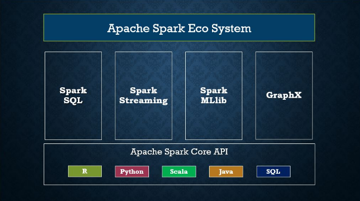
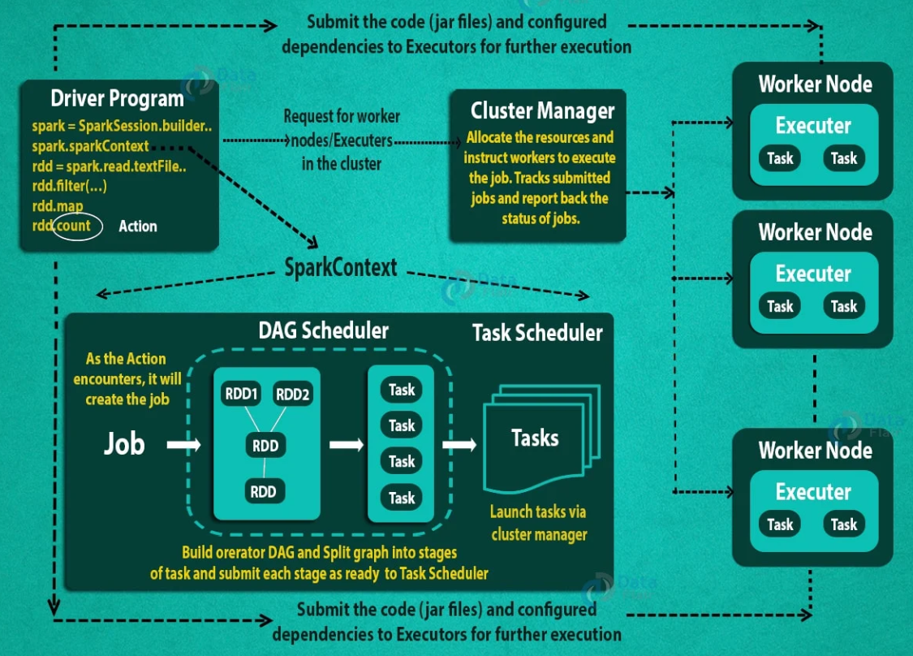
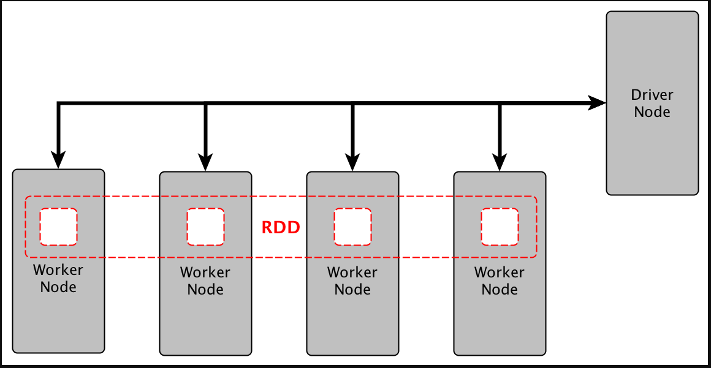
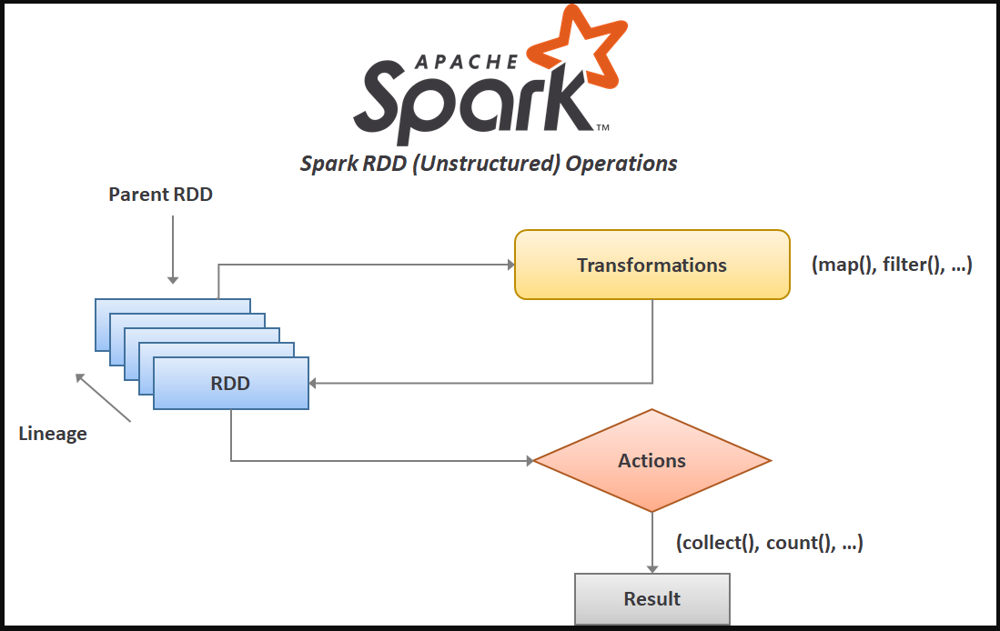
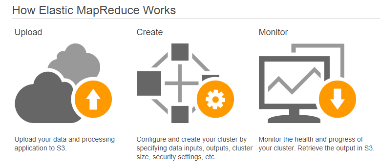

# Apache Spark for Java Developers

> Apache Spark is a multi-language engine for executing data engineering, data science, and machine learning on single-node machines or clusters.

Key Features:

- SQL analytics using **RDDs** and **SparkSQL**

Execute fast, distributed ANSI SQL queries for dash-boarding and ad-hoc reporting. Runs faster than most data
warehouses.

- Batch/streaming data using **Spark Streaming**

Unify the processing of data in batches and real-time streaming.

- Machine learning using **SparkML**

Train machine learning algorithms on a laptop and use the same code to scale to fault-tolerant clusters of thousands of
machines.

## Table of contents

### [Part I - Spark RDD](https://github.com/backstreetbrogrammer/11_JavaSpark#part-i---spark-rdd)

1. [The Big Picture](https://github.com/backstreetbrogrammer/11_JavaSpark#chapter-01-the-big-picture)
    - Big Data
    - Local versus Distributed Systems
    - Apache Hadoop and MapReduce
    - Apache Spark Ecosystem
    - Cluster Mode Overview
    - Spark RDDs
2. [Spark Installation and IntelliJ Project Setup](https://github.com/backstreetbrogrammer/11_JavaSpark#chapter-02-spark-installation-and-intellij-project-setup)
    - JDK, Scala, Maven and IntelliJ installation
    - Apache Spark and Hadoop installation
    - Download `winutils.exe` and `hadoop.dll` (only for `Windows`)
    - Verify Spark installation using Spark Shell
    - IntelliJ Project Setup - Maven
3. [Spark RDD - First Program](https://github.com/backstreetbrogrammer/11_JavaSpark#chapter-03-spark-rdd---first-program)
    - SparkContext
    - SparkSession
    - Initializing Spark
    - Spark Web UI
4. [Create RDD using `parallelize()`](https://github.com/backstreetbrogrammer/11_JavaSpark#chapter-04-create-rdd-using-parallelize)
5. [Create RDD using External Datasets](https://github.com/backstreetbrogrammer/11_JavaSpark#chapter-05-create-rdd-using-external-datasets)
6. [Spark RDD Actions - `reduce()`, `fold()`, `aggregate()`](https://github.com/backstreetbrogrammer/11_JavaSpark#chapter-06-spark-rdd-actions---reduce-fold-aggregate)
7. [Spark RDD Transformations - `map()`, `flatMap()`, `filter()`](https://github.com/backstreetbrogrammer/11_JavaSpark#chapter-07-spark-rdd-transformations---map-flatmap-filter)
8. [Spark RDD - Printing elements](https://github.com/backstreetbrogrammer/11_JavaSpark#chapter-08-spark-rdd---printing-elements)
9. [Spark RDD - Tuples](https://github.com/backstreetbrogrammer/11_JavaSpark#chapter-09-spark-rdd---tuples)
10. [Spark RDD - PairRDDs](https://github.com/backstreetbrogrammer/11_JavaSpark#chapter-10-spark-rdd---pairrdds)
11. [Exercise 1 - Unique Word Count](https://github.com/backstreetbrogrammer/11_JavaSpark#chapter-11-exercise-1---unique-word-count)
12. [Spark RDD - `repartition()`, `coalesce()`](https://github.com/backstreetbrogrammer/11_JavaSpark#chapter-12-spark-rdd---repartition-coalesce)
13. [Spark RDD - Joins](https://github.com/backstreetbrogrammer/11_JavaSpark#chapter-13-spark-rdd---joins)
14. [Spark RDD - Shuffles](https://github.com/backstreetbrogrammer/11_JavaSpark#chapter-14-spark-rdd---shuffles)
15. [Spark RDD - Persistence](https://github.com/backstreetbrogrammer/11_JavaSpark#chapter-15-spark-rdd---persistence)
    - Cache vs Persist
    - Persistence Storage Levels
16. [Spark RDD - Closures and Shared Variables](https://github.com/backstreetbrogrammer/11_JavaSpark#chapter-16-spark-rdd---closures-and-shared-variables)
    - Accumulators
    - Broadcast Variables
17. [Spark RDD - Submitting applications](https://github.com/backstreetbrogrammer/11_JavaSpark#part-i---spark-rdd)
18. [Databricks and AWS EMR](https://github.com/backstreetbrogrammer/11_JavaSpark#chapter-18-databricks-and-aws-emr)
19. [Introduction to Kryo Serialization](https://github.com/backstreetbrogrammer/11_JavaSpark#chapter-19-introduction-to-kryo-serialization)
20. [Tuning Spark](https://github.com/backstreetbrogrammer/11_JavaSpark#chapter-20-tuning-spark)

### Part II - Spark SQL

### Part III - Spark Streaming

### Part IV - Spark ML

### Youtube


[Java and Spark playlist](https://www.youtube.com/playlist?list=PLQDzPczdXrTgqEc0uomGYDS0SFu7qY3g3)

- [01 - Apache Spark for Java Developers - Tutorial Series](https://youtu.be/zXflI5htMlo)
- [02 - Apache Spark for Java Developers - Table of Contents](https://youtu.be/J6tqnBNLW2Q)

---

## Part I - Spark RDD

### Chapter 01. The Big Picture

#### 1.1 Big Data

Big data is a term that describes large, hard-to-manage volumes of data – both _structured_ and _unstructured_ – that
inundate businesses on a day-to-day basis.

These data sets are so voluminous that traditional data processing software just can’t manage them. But these massive
volumes of data can be used to address business problems we would not have been able to tackle before.


| Name | Value (10^) | Value (2^) |
| ----------- |-------------|------------|
| kilobyte (kB) | 10^3        | 2^10       |
| megabyte (MB)    | 10^6        | 2^20       |
| gigabyte (GB)    | 10^9        | 2^30       |
| terabyte (TB)    | 10^12       | 2^40       |
| petabyte (PB)    | 10^15       | 2^50       |
| exabyte (EB)    | 10^18       | 2^60       |
| zettabyte (ZB) | 10^21       | 2^70       |
| yottabyte (YB) | 10^24       | 2^80       |

Some interesting statistics:

- More than **1 exabytes** worth of data are generated each day
- There are currently over **64.2 zettabytes** of data in the entire digital universe in 2020 and expected to reach
  **175 zettabytes** in 2025
- The average person generates **1.7 MB** of data per second
- 90% of the world’s data has been created in the last two years

The **5V's** of Big Data:

###### Volume

The amount of data matters. With big data, we’ll have to process high volumes of low-density, unstructured data. This
can be data of unknown value, such as Twitter data feeds, click-streams on a web page or a mobile app, or sensor-enabled
equipment. For some organizations, this might be tens of terabytes of data. For others, it may be hundreds of petabytes.

###### Velocity

Velocity is the fast rate at which data is received and (perhaps) acted on. Normally, the highest velocity of data
streams directly into memory versus being written to disk. Some internet-enabled smart products operate in real time or
near real time and will require real-time evaluation and action.

###### Variety

Variety refers to the many types of data that are available. Traditional data types were structured and fit neatly in a
relational database. With the rise of big data, data comes in new unstructured data types. Unstructured and
semi-structured data types, such as text, audio, and video, require additional preprocessing to derive meaning and
support metadata.

###### Value

The bulk of data having no Value is of no good to the company, unless we turn it into something useful. Data in itself
is of no use or importance, but it needs to be converted into something valuable to extract information. Hence, we can
state that Value is the most important V of all the 5V’s.

###### Veracity

Veracity refers to inconsistencies and uncertainty in data, that is data which is available can sometimes get messy and
quality and accuracy are difficult to control. Big Data is also variable because of the multitude of data dimensions
resulting from multiple disparate data types and sources. Example: Data in bulk could create confusion whereas less
amount of data could convey half or incomplete information.

#### Youtube

- [03 - Apache Spark for Java Developers - Big Data](https://youtu.be/6WFS9UXP93w)

#### 1.2 Local versus Distributed Systems

Big data can not be processed or stored in a local system or a single node. It requires multiple machines or nodes to
store / process it.

**Master Node => Worker nodes**

A local single node will use the computation sources (CPU, cores) and storage (memory, hard disk) of a single machine
only. Only **vertical scaling** is possible which means we can add powerful CPU or memory to a single machine but there
will be a limit to it. Single point of failure if the local node goes down which makes it essential to store the
important data in cloud or separate disk.

A distributed system has access to the computation sources (CPU, cores) and storage (memory, hard disk) across a number
of machines connected through a network. **Horizontal scaling** is easier by just adding new nodes or systems to the
distributed system. It also supports **fault tolerance**, if one machine fails, the whole network can still go on.


#### Youtube

- [04 - Apache Spark for Java Developers - Local vs Distributed Systems](https://youtu.be/WBrAPR5JyBw)

#### 1.3 Apache Hadoop and MapReduce

Apache Hadoop is a collection of open-source software utilities that facilitates using a network of many computers to
solve problems involving massive amounts of data and computation. It provides a software framework for distributed
storage and processing of big data using the **MapReduce** programming model.

Hadoop uses **Hadoop Distributed File System (HDFS)** which is a distributed, scalable, and portable file system written
in Java for the Hadoop framework and allows user to work with large data sets. It also duplicates blocks of data for
**fault tolerance**.

HDFS uses **MapReduce** which allows computations on that data.

HDFS uses blocks of data of default size **128 MB** and replicates it multiple times to the slave nodes for fault
tolerance.

**MapReduce** is a way of splitting a computational task to a distributed set of files such as HDFS. It consists of a
**Job Tracker** at **Master** Node and multiple **Task Trackers** in the **slave** nodes. Job Tracker sends code to run
on the Task Trackers. The Task Trackers allocate CPU and memory for the tasks and monitor the tasks on the worker nodes.


To summarize,

- **HDFS** is used to distribute large data sets
- **MapReduce** is used to distribute a computational task to a distributed data set

#### Youtube

- [05 - Apache Spark for Java Developers - Hadoop and MapReduce](https://youtu.be/e2AYdWC44i4)

#### 1.4 Apache Spark Ecosystem

Apache Spark is a multi-language engine for executing data engineering, data science, and machine learning on
single-node machines or clusters.

Key Features:

- SQL analytics using **RDDs** and **SparkSQL**

Execute fast, distributed ANSI SQL queries for dashboards and ad-hoc reporting. Runs faster than most data warehouses.

- Machine learning using **SparkML**

Train machine learning algorithms on a laptop and use the same code to scale to fault-tolerant clusters of thousands of
machines.

- Batch/streaming data using **Spark Streaming**

Unify the processing of data in batches and real-time streaming.



Spark is a flexible alternative to MapReduce.

MapReduce requires files to be stored only in HDFS, while Spark can work on data stored in a variety of formats like
HDFS, AWS S3, Cassandra, HBase etc.

Spark can perform operations up to 100X faster than **MapReduce** because MapReduce writes most of the data to disk
after each map and reduce operation; however Spark keeps most of the data in memory after each transformation. Spark
will write to disk only when the memory is full.

#### Youtube

- [06 - Apache Spark for Java Developers - Spark Ecosystem](https://youtu.be/fmQe_wj6f-4)

#### 1.5 Cluster Mode Overview


Spark applications run as independent sets of processes on a cluster, coordinated by the `SparkContext` object in our
`main` program (called the `driver` program).

Specifically, to run on a cluster, the `SparkContext` can connect to several types of cluster managers (either Spark’s
own `standalone` cluster manager, `Mesos`, `YARN` or `Kubernetes`), which allocate resources across applications. Once
connected, Spark acquires executors on nodes in the cluster, which are processes that run computations and store data
for our application. Next, it sends our application code (defined by JAR or Python files passed to `SparkContext`) to
the executors. Finally, `SparkContext` sends tasks to the executors to run.

#### Youtube

- [07 - Apache Spark for Java Developers - Cluster Mode Overview](https://youtu.be/WIZPjSGW78Q)

To dig deeper into the internals of job execution in Spark:



In our **master** node, we have the **driver** program, which drives our application. The code we are writing behaves as
a driver program or if we are using the interactive shell (Scala or Python), the shell acts as the driver program.

Inside the driver program, the first thing we do is, we create a **Spark Context**. Assume that the Spark context is a
gateway to all the Spark functionalities. It is similar to a database connection. Any command we execute in our database
goes through the database connection. Likewise, anything we do on Spark goes through Spark context.

Now, this Spark context works with the **Cluster Manager** to manage various jobs. The driver program & Spark context
takes care of the job execution within the cluster. A job is split into multiple tasks which are distributed over the
worker node. Anytime an RDD is created in Spark context, it can be distributed across various nodes and can be cached
there.

**Worker** nodes are the slave nodes whose job is to basically execute the tasks. These tasks are then executed on the
partitioned RDDs in the worker node and hence returns the result to the Spark Context.

Spark Context takes the job, breaks the job in tasks and distribute them to the worker nodes. These tasks work on the
partitioned RDD, perform operations, collect the results and return to the main Spark Context.

If we increase the number of workers, then we can divide jobs into more partitions and execute them in parallel over
multiple systems. It will be a lot faster.

With the increase in the number of workers, memory size will also increase & we can cache the jobs to execute it faster.

**STEP 1**: The client submits spark user application code. When an application code is submitted, the driver implicitly
converts user code that contains transformations and actions into a logically **directed acyclic graph** called DAG. At
this stage, it also performs optimizations such as pipelining transformations.

**STEP 2**: After that, it converts the logical graph called DAG into physical execution plan with many stages. After
converting into a physical execution plan, it creates physical execution units called **tasks** under each stage. Then
the tasks are bundled and sent to the cluster.

**STEP 3**: Now the driver talks to the cluster manager and negotiates the resources. Cluster manager launches executors
in worker nodes on behalf of the driver. At this point, the driver will send the tasks to the executors based on data
placement. When executors start, they register themselves with drivers. So, the driver will have a complete view of
executors that are executing the task.

**STEP 4**: During the course of execution of tasks, driver program will monitor the set of executors that runs. Driver
node also schedules future tasks based on data placement.

Few more points to note,

- Each application gets its own executor processes, which stay up for the duration of the whole application and run
  tasks in multiple threads. This has the benefit of isolating applications from each other, on both the scheduling
  side (each driver schedules its own tasks) and executor side (tasks from different applications run in **different**
  JVMs). However, it also means that data cannot be shared across different Spark applications (instances
  of `SparkContext`) without writing it to an external storage system.
- Spark is agnostic to the underlying cluster manager. As long as it can acquire executor processes, and these
  communicate with each other, it is relatively easy to run it even on a cluster manager that also supports other
  applications (e.g. Mesos/YARN/Kubernetes).
- The driver program must listen for and accept incoming connections from its executors throughout its lifetime. As
  such, the driver program must be network addressable from the worker nodes.
- Because the driver schedules tasks on the cluster, it should be run close to the worker nodes, preferably on the same
  local area network. If we’d like to send requests to the cluster remotely, it’s better to open an RPC to the driver
  and have it submit operations from nearby than to run a driver far away from the worker nodes.

#### Youtube

- [08 - Apache Spark for Java Developers - Internals of Job Execution](https://youtu.be/GGBsUJqUwa0)

#### 1.6 Spark RDDs

**RDD (Resilient Distributed Dataset)** is the fundamental data structure of Apache Spark which are an immutable
collection of objects which computes on the different nodes of the cluster. Each and every dataset in Spark RDD is
logically partitioned across many servers so that they can be computed on different nodes of the cluster.



RDD stands for:

- **Resilient**: Fault tolerant and is capable of rebuilding data on failure
- **Distributed**: Distributed data among the multiple nodes in a cluster
- **Dataset**: Collection of partitioned data with values

The term **Resilient** defines the ability that generates the data automatically or data rolling back to the original
state when an unexpected calamity occurs with a probability of data loss.

The data written into RDDs is partitioned and stored into multiple executable nodes. If an executing node fails in the
run time, then it instantly gets the back up from the next executable node. RDDs can store structured, unstructured and
semi-structured data.

RDD has these main features:

- “In-memory” computations: The concept of in-memory computation takes the data processing to a faster and efficient
  stage where the overall performance of the system is upgraded.
- Distributed collection of data and cacheable: The resultant RDDs are always persistable and reusable.
- Lazily evaluated: The term Lazy evaluation says the transformations are applied to the data in RDD, but the output is
  not generated. Instead, the applied transformations are **logged**.
- Fault Tolerant: If there is a loss of data, the system can roll back to its original state by using the logged
  transformations.
- Parallel operation - partitioned: It is the crucial unit of parallelism in Spark RDD. By default, the number of
  partitions created is based on our data source. We can even decide the number of partitions we wish to make using
  custom partition functions.
- Immutability: Data defined, retrieved or created cannot be changed once it is logged into the system. In case if we
  need to access and modify the existing RDD, we must create a new RDD by applying a set of **Transformation** functions
  on to the current or preceding RDD.
- Coarse-Grained Operations: The user can apply transformations to all elements in data sets through map, filter or
  group by operations.
- Ability to use various data sources: text file, csv, json, zipped, MongoDb, Cassandra, AWS S3, MySQL, HBase, etc.

#### Youtube

- [09 - Apache Spark for Java Developers - RDDs Overview](https://youtu.be/1RIWiH4s-9w)



RDDs support 2 kinds of operations:

1. **Transformation** – Spark RDD transformation is a function that produces new RDD from the existing RDDs. The
   transformer takes RDD as input and produces one or more RDD as output. Transformations are **lazy** in nature i.e.,
   they get execute when we call an action.

We can divide transformations into two types as below:

- Narrow Transformations : We apply narrow transformations on to a single partition of the parent RDD to generate a new
  RDD as data required to process the RDD is available on a single partition of the parent RDD. The examples for narrow
  transformations are:
    - map()
    - filter()
    - flatMap()
    - partition()
    - mapPartitions()

- Wide Transformations: We apply the wide transformation on multiple partitions to generate a new RDD. The data required
  to process the RDD is available on the multiple partitions of the parent RDD. The examples for wide transformations
  are:
    - reduceBy()
    - union()

2. **Action** – transformations create RDDs from each other, but when we want to work with the actual data set, at that
   point action is performed. Thus, Actions are Spark RDD operations that give non-RDD values. The values of action are
   stored to drivers or to the external storage system.

Few of the actions include:

- collect()
- count()
- take()
- first()

An action is one of the ways of sending data from **Executor** to the driver.

**Executors** are agents that are responsible for executing a task. While the driver is a JVM process that coordinates
workers and execution of the task.

#### Youtube

- [10 - Apache Spark for Java Developers - RDD Operations](https://youtu.be/KX15aMsK9-Y)

---

### Chapter 02. Spark Installation and IntelliJ Project Setup

#### 2.1 JDK, Scala, Maven and IntelliJ installation

- **JDK 11 download**: https://jdk.java.net/archive/

  Windows zip: https://download.java.net/java/GA/jdk11/13/GPL/openjdk-11.0.1_windows-x64_bin.zip

- **Scala installation**: https://www.scala-lang.org/download/2.13.10.html

  Windows msi: https://downloads.lightbend.com/scala/2.13.10/scala-2.13.10.msi

- **Maven download**: https://maven.apache.org/download.cgi

  Windows zip: https://dlcdn.apache.org/maven/maven-3/3.8.6/binaries/apache-maven-3.8.6-bin.zip

- **IntelliJ IDEA download**: https://www.jetbrains.com/idea/download/#section=windows

  Windows: https://www.jetbrains.com/idea/download/download-thanks.html?platform=windows&code=IIC

- Set JAVA_HOME, M2_HOME, MAVEN_HOME system variables and set in PATH

#### Youtube

- [11 - JDK, Scala, Maven and IntelliJ installation](https://youtu.be/VN4k73Q7WjA)

#### 2.2 Download Apache Spark and Hadoop

1. Download Apache Spark version 3.3.1 from [spark official site](https://spark.apache.org/downloads.html)
2. Download Spark zipped file
   [spark-3.3.1-bin-hadoop3.tgz](https://www.apache.org/dyn/closer.lua/spark/spark-3.3.1/spark-3.3.1-bin-hadoop3.tgz)
3. Unzip the file to local folder - `tar -zxvf spark-3.3.1-bin-hadoop3.tgz`
4. Set `SPARK_HOME` environment variable to `<downloaded folder>\spark-3.3.1-bin-hadoop3`
5. Set `HADOOP_HOME` environment variable to `<downloaded folder>\spark-3.3.1-bin-hadoop3`
6. Add to the `PATH` environment, the `%SPARK_HOME%\bin`
7. Add to the `PATH` environment, the `%HADOOP_HOME%\bin`

#### 2.3 Download winutils.exe and hadoop.dll (only for Windows)

- Download [winutils.exe](https://github.com/cdarlint/winutils/blob/master/hadoop-3.2.2/bin/winutils.exe) and place it
  in local `%SPARK_HOME%\bin` folder.
- Download [hadoop.dll](https://github.com/cdarlint/winutils/blob/master/hadoop-3.2.2/bin/hadoop.dll) and place it in
  local `%SPARK_HOME%\bin` folder.

#### Youtube

- [12 - Apache Spark and Hadoop installation](https://youtu.be/LcRxQjTdD1o)

#### 2.4 Verify Spark installation

1. Open Windows command prompt `cmd` as **Administrator**
2. Navigate to folder `%SPARK_HOME%\bin` by typing command: `cd %SPARK_HOME%\bin`
3. Launch spark shell: `spark-shell2.cmd`
4. Output will display lots of information like log level, Spark/Scala/Java version, Spark Context Web UI, Spark
   context, Spark session objects, etc.
5. Type few commands to learn some basics

- Spark Session (can be multiple per JVM)

```
scala> spark
res1: org.apache.spark.sql.SparkSession = org.apache.spark.sql.SparkSession@d6db63e
```

- Spark Context (1 per JVM)

```
scala> sc
res2: org.apache.spark.SparkContext = org.apache.spark.SparkContext@4da86d09
```

- Create Spark RDD

```
scala> val myRdd = spark.sparkContext.parallelize(Seq(5,4,3,2,1))
myRdd: org.apache.spark.rdd.RDD[Int] = ParallelCollectionRDD[0] at parallelize at <console>:22
```

- Print the above RDD

```
scala> myRdd.foreach(println)
4
3
2
1
5
```

- Count number of partitions in RDD

```
scala> myRdd.getNumPartitions
res5: Int = 4
```

- Count RDD elements

```
scala> myRdd.count
res6: Long = 5
```

- Exit Spark Shell

```
scala> :quit
```

#### Youtube

- [13 - Apache Spark for Java Developers - Shell Commands](https://youtu.be/U9wM_SxCPLU)

#### 2.5 IntelliJ Project Setup - Maven

We can create a Maven project and add spark dependencies.

```
        <dependency>
            <groupId>org.apache.spark</groupId>
            <artifactId>spark-core_2.13</artifactId>
            <version>${apache-spark.version}</version>
        </dependency>

        <dependency>
            <groupId>org.apache.spark</groupId>
            <artifactId>spark-sql_2.13</artifactId>
            <version>${apache-spark.version}</version>
        </dependency>

        <dependency>
            <groupId>org.apache.hadoop</groupId>
            <artifactId>hadoop-hdfs</artifactId>
            <version>${hadoop.version}</version>
        </dependency>

        <dependency>
            <groupId>org.apache.hadoop</groupId>
            <artifactId>hadoop-common</artifactId>
            <version>${hadoop.version}</version>
        </dependency>

        <dependency>
            <groupId>org.apache.hadoop</groupId>
            <artifactId>hadoop-client</artifactId>
            <version>${hadoop.version}</version>
        </dependency>

        <dependency>
            <groupId>org.apache.hadoop</groupId>
            <artifactId>hadoop-aws</artifactId>
            <version>${hadoop.version}</version>
        </dependency>
```

Latest apache spark version as of this writing is **3.3.1**

Latest hadoop version as of this writing is **3.3.4**

Complete `pom.xml` can be found at Github:
[pom.xml](https://github.com/backstreetbrogrammer/11_JavaSpark/blob/main/pom.xml)

Run Maven Verify command to ensure Maven setup is complete: `mvn verify`

#### Youtube

- [14 - Apache Spark for Java Developers - IntelliJ Project Maven Setup](https://youtu.be/lw-U8y-DiEA)

---

### Chapter 03. Spark RDD - First Program

Every Spark application consists of a **driver program** that runs the user’s `main` function and executes various
parallel operations on a cluster. Spark provides RDD, which is a collection of elements partitioned across the nodes of
the cluster that can be operated on in parallel.

RDDs are created by starting with a file in HDFS or other supported file systems, or an existing Scala collection in the
driver program, and transforming it. Users may also ask Spark to persist an RDD in **memory**, allowing it to be reused
efficiently across parallel operations. Also, RDDs automatically recover from node failures.

Spark uses **shared variables** in parallel operations. By default, when Spark runs a function in parallel as a set of
tasks on different nodes, it ships a copy of each variable used in the function to each task. Sometimes, a variable
needs to be shared across tasks, or between tasks and the driver program.

Spark supports 2 types of shared variables:

- **broadcast variables** => to cache a value in memory on all nodes
- **accumulators** => variables that are only “added” to, such as counters and sums

#### SparkContext

`SparkContext` has been available since Spark 1.x versions, and it’s an entry point to Spark when we want to program and
use Spark RDD. Most of the operations/methods or functions we use in Spark comes from `SparkContext` for example
accumulators, broadcast variables, parallelize and more.

#### SparkSession

Since Spark 2.0, `SparkSession` has become an entry point to Spark to work with RDD, DataFrame, and Dataset. Prior to
2.0, `SparkContext` used to be an entry point.

We can create as many `SparkSession` as we want in a Spark application using either `SparkSession.builder()` or
`SparkSession.newSession()`.

#### Youtube

- [15 - Apache Spark First Java Program - Theory](https://youtu.be/8C5zOVVxGSE)

#### Initializing Spark

1. Build a `SparkConf` object that contains information about the application

```
final var conf = new SparkConf().setAppName("SparkFirstProgram").setMaster("local[*]");
```

OR, we can create a `SparkSession` object containing all the above configurations.

```
final var spark = SparkSession.builder()
                              .appName("SparkFirstProgram")
                              .master("local[*]")
                              .getOrCreate();
```

The `appName` parameter is a name for the application to show on the cluster UI.

The `master` is a
[Spark, Mesos or YARN cluster URL](https://spark.apache.org/docs/latest/submitting-applications.html#master-urls), or a
special “local” string to run in local mode. When running on a cluster, we will not want to hardcode master in the
program, but rather launch the application
with [spark-submit](https://spark.apache.org/docs/latest/submitting-applications.html) and receive it there. However,
for local testing and unit tests, we can pass “local” to run Spark in-process.

`local[*]` means run Spark locally with as many worker threads as logical cores on the machine.

2. Create a `JavaSparkContext` object which tells Spark how to access a cluster, by passing the `SparkConf` object to
   its constructor

- JavaSparkContext(SparkConf conf)

```
final var sc = new JavaSparkContext(conf);
```

- JavaSparkContext(SparkContext sc)

```
// Using SparkSession
final var sc = new JavaSparkContext(spark.sparkContext());
```

#### Youtube

- [16 - Apache Spark First Java Program - Create JavaSparkContext](https://youtu.be/5F8XrorD11U)
- [17 - Apache Spark First Java Program - Understand Spark configuration](https://youtu.be/MW8jqOQ7nMY)

3. Create RDD which is a fault-tolerant collection of elements that can be operated on in parallel

There are two ways to create RDDs:

- **parallelizing** an existing collection in the driver program (only used for POC or prototyping)
- referencing a dataset in an **external storage system**, such as a shared filesystem, HDFS, HBase, or any data source
  offering a Hadoop `InputFormat`

4. Various **Transformations** (map, filter, etc.) and **Actions** (count, collect, etc.) can be called on RDD

#### Youtube

- [18 - Apache Spark First Java Program - Create Spark RDD](https://youtu.be/H2a34mu_8wk)
- [19 - Apache Spark First Java Program - Spark RDD Reduce Method](https://youtu.be/6XATrvANmaY)

#### Spark Web UI

Spark Web UI can be viewed in browser using default port of 4040:

```
http://localhost:4040/
```

Spark UI is separated into following tabs:

1. Jobs

The details provided in this tab are:

- Scheduling mode: As we are running on a local machine, its **Standalone mode**. The standalone cluster mode currently
  only supports a simple FIFO scheduler across applications.
- Number of Spark Jobs: The number of Spark jobs is equal to the number of **actions** in the application and each Spark
  job should have at least one **Stage**.
- Number of Stages: Only **Wide Transformation** results in a separate Number of Stages.
- Description: Description links the complete details of the associated **SparkJob** like Spark Job Status, DAG
  Visualization, Completed Stages, etc.

2. Stages

We can navigate into Stages tab in two ways:

- Select the **Description** of the respective Spark job
- On the top of Spark Web UI: select **Stages** tab

The Stages tab displays a summary page that shows the current state of all stages of all Spark jobs in the spark
application.

The number of **Tasks** we could see in each stage is the number of **partitions** that Spark is going to work on and
each task inside a stage is the same work that will be done by spark but on a different partition of data.

**DAG Visualization**: Displays Directed Acyclic Graph (DAG) of this stage, where vertices represent the RDDs or
DataFrame and edges represent an operation to be applied.

**ParallelCollectionRDD** is created when we create a RDD with a collection object.

3. Storage

The Storage tab displays the persisted RDDs and DataFrames, if any, in the application. The **Summary** page shows the
storage levels, sizes and partitions of all RDDs, and the **Details** page shows the sizes and using executors for all
partitions in an RDD or DataFrame.

4. Environment

The Environment tab displays the values for the different environment and configuration variables, including JVM, Spark,
and system properties. It is a useful place to check whether our Spark application properties have been set correctly.

This Environment tab has 6 parts:

- Runtime Information: simply contains the runtime properties like versions of Java and Scala
- Spark Properties: lists the application properties like `spark.app.name` and `spark.driver.extraJavaOptions`
- Resource Profiles: gives details about Executor and Tasks cpu and memory usages
- Hadoop Properties: displays very detailed properties relative to Hadoop, HDFS and YARN
- System Properties: shows more details about the JVM
- Classpath Entries: lists the classes loaded from different sources, which is very useful to resolve class conflicts.

5. Executors

The Executors tab displays:

- **Summary**
  Information about the executors that were created for the application, including memory, disk usage, task and shuffle
  information (if any). The **Storage Memory** column shows the amount of memory **used** and **reserved** for caching
  data.

- **Executors**
  Provides more detailed resource information like amount of memory, disk, and cores used by each executor. **Thread
  Dump** for executor driver can be clicked to see the whole thread dump.

#### Youtube

- [20 - Spark Web UI - Jobs tab](https://youtu.be/2_WDDVAsSlU)
- [21 - Spark Web UI - Stages, Storage and Environment tabs](https://youtu.be/_KxEwh-pM2g)
- [22 - Spark Web UI - Executors tab](https://youtu.be/WqUJUMwqzI8)

---

### Chapter 04. Create RDD using parallelize()

Parallelized collections are created by calling JavaSparkContext’s `parallelize()` method on an existing
`Collection` in the **driver** program. The elements of the collection are copied to form a **RDD** that can be operated
on in parallel.

```
final var data = List.of(1, 2, 3, 4, 5, 6, 7, 8);
final var myRdd = sc.parallelize(data);
```

RDD created `myRdd` can be operated on in parallel. These operations can be to _reduce_, _map_, etc.

```
final var max = myRdd.reduce(Integer::max);
final var min = myRdd.reduce(Integer::min);
final var sum = myRdd.reduce(Integer::sum);
```

One important parameter for parallel collections is the number of **partitions** to cut the dataset into. Spark will run
one task for each partition of the cluster.

We may want 2-4 partitions for each CPU in the cluster. Spark tries to set the number of partitions automatically based
on our cluster.

We can get the number of partitions being used by calling this method:

```
myRdd.getNumPartitions()
```

However, we can also set it manually by passing it as a second parameter to parallelize() method.

```
sc.parallelize(data, 10)
```

We can also create Empty RDDs by calling `emptyRDD()` method on `JavaSparkContext` object.

```
final var emptyRDD = sparkContext.emptyRDD();
```

#### Youtube

- [23 - Create RDD using parallelize method - Theory](https://youtu.be/6XfTQTpVQiA)
- [24 - Create Empty RDD using parallelize method - Code Demo](https://youtu.be/g_5mO1MGIus)
- [25 - Create Spark RDD from Java Collection using parallelize method - Code Demo](https://youtu.be/oLyta4sSn-w)

---

### Chapter 05. Create RDD using External Datasets

Spark can create distributed datasets from any storage source supported by Hadoop like:

- Local file system
- HDFS
- Cassandra
- HBase
- Amazon S3, etc.

Spark supports:

- Text files
- [SequenceFiles](https://hadoop.apache.org/docs/stable/api/org/apache/hadoop/mapred/SequenceFileInputFormat.html)
- Any Hadoop [InputFormat](https://hadoop.apache.org/docs/stable/api/org/apache/hadoop/mapred/InputFormat.html)

**Text file** RDDs can be created using `SparkContext`’s `textFile()` method. This method takes a **URI** for the file
(either a local path on the machine, or a `hdfs://`, `s3a://`, etc. URI) and reads it as a collection of lines.

Example:

```
JavaRDD<String> dataFile = sc.textFile("data.txt");
```

Once created, `dataFile` can be acted on by dataset operations like _map_ or _reduce_.

Few important points to read files in Spark:

- If using a path on the local filesystem, the file must also be accessible at the same path on **worker nodes**. Either
  copy the file to all workers or use a network-mounted shared file system.
- All of Spark’s file-based input methods, including `textFile`, support running on **directories**, **compressed**
  files, and **wildcards** as well. For example, we can use:

```
sc.textFile("/my/directory")
sc.textFile("/my/directory/*.txt")
sc.textFile("/my/directory/*.gz")
```

- The `textFile()` method also takes an optional **second** argument for controlling the number of partitions of the
  file. By default, Spark creates **one** partition for each block of the file (blocks being `128MB` by default in HDFS)
  , but we can also ask for a higher number of partitions by passing a larger value. Note that we cannot have fewer
  partitions than blocks.

Apart from **text files**, Spark’s Java API also supports several other data formats:

- `JavaSparkContext.wholeTextFiles()` lets us read a directory containing multiple small text files, and returns each of
  them as **(filename, content)** pairs. This is in contrast with `textFile()`, which would return one record per line
  in each file.
- For [SequenceFiles](https://hadoop.apache.org/docs/stable/api/org/apache/hadoop/mapred/SequenceFileInputFormat.html),
  use SparkContext’s `sequenceFile[K, V]` method where `K` and `V` are the types of key and values in the file. These
  should be subclasses of
  Hadoop’s [Writable](https://hadoop.apache.org/docs/stable/api/org/apache/hadoop/io/Writable.html) interface, like
  [IntWritable](https://hadoop.apache.org/docs/stable/api/org/apache/hadoop/io/IntWritable.html)
  and [Text](https://hadoop.apache.org/docs/stable/api/org/apache/hadoop/io/Text.html).
- For other Hadoop `InputFormats`, we can use the `JavaSparkContext.hadoopRDD()` method, which takes an arbitrary
  `JobConf` and input format class, key class and value class. Set these the same way we would for a Hadoop job with our
  input source. We can also use `JavaSparkContext.newAPIHadoopRDD()` for `InputFormats` based on the “new” MapReduce
  API (`org.apache.hadoop.mapreduce`).
- `JavaRDD.saveAsObjectFile()` and `JavaSparkContext.objectFile()` support saving an RDD in a simple format consisting
  of **serialized** Java objects. While this is not as efficient as specialized formats like **Avro**, it offers an easy
  way to save any RDD.

#### Load files from Amazon S3

Amazon S3 is a highly durable, scalable, secure, fast and inexpensive storage service. With the EMR File System (EMRFS),
Amazon EMR can efficiently and securely use Amazon S3 as an object store for Hadoop. Amazon EMR has made numerous
improvements to Hadoop, allowing us to seamlessly process large amounts of data stored in Amazon S3.

We need to use Third Generation `s3a:\\` which supports larger files and improves in performance. However, Second
Generation `s3n:\\` may also be used but not recommended.

Example:

```
            // Replace Key with AWS account key (can find this on IAM)
            sparkContext.hadoopConfiguration().set("fs.s3a.access.key", "AWS access-key value");

            // Replace Key with AWS secret key (can find this on IAM)
            sparkContext.hadoopConfiguration().set("fs.s3a.secret.key", "AWS secret-key value");

            // Set the AWS S3 end point
            sparkContext.hadoopConfiguration().set("fs.s3a.endpoint", "s3.amazonaws.com");

            // Read a single text file
            final var myRdd = sparkContext.textFile("s3a://backstreetbrogrammer-bucket/1TrillionWords.txt.gz");
```

#### Youtube

- [26 - Create Spark RDD using External Datasets - Theory](https://youtu.be/zyXVDRvN4GA)
- [27 - Create Spark RDD using External Datasets - Unit Test Code Demo 1](https://youtu.be/F5SaCBDia-I)
- [28 - Create Spark RDD using External Datasets - Unit Test Code Demo 2](https://youtu.be/of5q7SHso9s)
- [29 - Create Spark RDD from whole directory - Unit Test Code Demo 3](https://youtu.be/KmNZdrDbHfw)
- [30 - Create Spark RDD from CSV file - Unit Test Code Demo 4](https://youtu.be/l1caOgH01zI)
- [31 - Create Spark RDD from AWS S3 Bucket File - Unit Test Code Demo 5](https://youtu.be/9flt2H8YiDQ)

---

### Chapter 06. Spark RDD Actions - reduce(), fold(), aggregate()

#### Action: `reduce(func)`

> Aggregate the elements of the dataset using a function func (which takes two arguments and returns one).
> The function should be commutative and associative so that it can be computed correctly in parallel.

As discussed, once `JavaRDD` object is created, it can be used to perform `reduce` operation.

In functional programming-language jargon, this is referred to as a **fold** because we can view this operation as
repeatedly folding a long piece of paper (our stream) until it forms a small square, which is the result of the **fold**
operation.

Example:

```
final var max = myRdd.reduce(Integer::max);
final var min = myRdd.reduce(Integer::min);
final var sum = myRdd.reduce(Integer::sum);
```

#### Action: `fold(zeroValue, func)`

> Since RDD’s are partitioned, the fold() function takes full advantage of it by first aggregating elements in
> each partition and then aggregating results of all partitions to get the final result.
> The result of this function is the same as this RDD type.

`fold()` takes the following arguments –

`zeroValue` – Initial value to be used for each partition in folding, this value would be used to initialize the
accumulator for each partition. We mostly use 0 for integer and empty for collections.

`func` – a function used to both accumulate results within a partition and combine results from all partitions

Example:

```
final var sum = myRdd.fold(0D, Double::sum);
```

#### Action: `aggregate(zeroValue, seqOp, combOp)`

> Since RDD’s are partitioned, the aggregate() function takes full advantage of it by first aggregating elements in
> each partition and then aggregating results of all partitions to get the final result.
> The result of this function could be any type and not necessarily same as this RDD type.

`aggregate()` takes the following arguments –

`zeroValue` – Initial value to be used for each partition in folding, this value would be used to initialize the
accumulator for each partition. We mostly use 0 for integer and empty for collections.

`seqOp` – a function used to accumulate the results of each partition, and stores the running accumulated result to U

`combOp` - a function used to combine the results of all partitions U

#### Difference between reduce(), fold(), aggregate()

- `reduce()` is similar to `fold()` except reduce takes a 0 value as an initial **default** value for each partition.
- `reduce()` is similar to `aggregate()` with a difference; `reduce()` return type should be the same as this RDD
  element type whereas `aggregate()` can return any type.
- `fold()` is similar to `reduce()` except it takes a `zeroValue` as an initial value **assigned by developer** for each
  partition.
- `fold()` is similar to `aggregate()` with a difference; `fold()` return type should be the same as this RDD element
  type whereas `aggregate()` can return any type.
- `aggregate()` is similar to `fold()` and `reduce()` except it returns RDD of any type whereas other 2 returns same RDD
  type.

#### Youtube

- [32 - Spark RDD Actions - reduce() - Code Demo 1](https://youtu.be/E1WpxgePSsY)
- [33 - Spark RDD Actions - reduce() - Code Demo 2](https://youtu.be/nZ-R42RXV7k)
- [34 - Spark RDD Actions - fold() - Code Demo](https://youtu.be/DLaSjq3sJrw)
- [35 - Spark RDD Actions - aggregate() - Code Demo](https://youtu.be/w6xzvI35VEw)

---

### Chapter 07. Spark RDD Transformations - map(), flatMap(), filter()

RDD Transformations are Spark operations when executed on RDD, it results in a single or multiple new RDD’s. Since RDD
are immutable in nature, transformations always create new RDD without updating an existing one.

RDD Transformations are **lazy** operations meaning none of the transformations get executed until we call an **action**
on Spark RDD. Since RDD’s are immutable, any transformations on it result in a new RDD leaving the current one
unchanged.

There are two types of RDD transformations:

- Narrow Transformation: Transformations which compute data living on a single partition => there will not be any data
  movement between partitions to execute narrow transformations. Functions such as `map()`, `mapPartition()`,
  `flatMap()`, `filter()`, `union()` are some examples of narrow transformation.
- Wider Transformation: Transformations which compute data living on many partitions => there will be data movements
  between partitions to execute wider transformations. Since these shuffles the data, they also called shuffle
  transformations. Functions such as `groupByKey()`, `aggregateByKey()`, `aggregate()`, `join()`, `repartition()` are
  some examples of a wider transformations.

When compared to Narrow transformations, wider transformations are expensive operations due to **shuffling**.

#### Transformation: `map(func)`

> Return a new distributed dataset formed by passing each element of the source through a function `func`.

As RDDs are immutable, after applying the `map` transformation, new RDD is created.

The `func` is applied to each element, mapping it into a new element (the word mapping is used because it has a meaning
similar to transforming but with the nuance of “creating a new version of” rather than “modifying”).

Example:

```
final var myList = myRdd.map(String::length).collect();
final var count = myRdd.map(String::length).count();
final var count = myRdd.map(String::length).map(v -> 1L).reduce(Long::sum);
```

#### Transformation: `flatMap(func)`

> Similar to map, but each input item can be mapped to 0 or more output items
> (so `func` should return a `Seq` or `Iterable` rather than a single item).

As RDDs are immutable, after applying the `flatMap` transformation, new RDD is created.

However, in functional programming-language jargon, the `flatMap` method lets us replace each value of a stream with
another stream and then concatenates all the generated streams into a single stream.

Example:

```
final var words = lines.flatMap(line -> List.of(line.split("\\s")).iterator());
```

#### Transformation: `filter(func)`

> Return a new dataset formed by selecting those elements of the source on which `func` returns true.

As RDDs are immutable, after applying the `filter` transformation, new RDD is created.

Example:

```
final var words = lines.flatMap(line -> List.of(line.split("\\s")).iterator());
final var filteredWords = words.filter(word -> ((word != null) && (word.trim().length() > 0)));
```

#### Youtube

- [36 - Spark RDD Transformations - map(), flatMap(), filter()](https://youtu.be/AptmZeSkbag)
- [37 - Spark RDD Transformations - Unit Test Code Demo](https://youtu.be/mlki4n9fkDE)
- [38 - Spark RDD Transformations - map() - Code Demo 1](https://youtu.be/iP_y_4yUXKY)
- [39 - Spark RDD Transformations - map() using collect() - Code Demo 2](https://youtu.be/J_d61gNYh5Y)
- [40 - Spark RDD Transformations - map() using reduce() - Code Demo 3](https://youtu.be/_BxO95FVHSQ)
- [41 - Spark RDD Transformations - flatMap() - Code Demo 1](https://youtu.be/ElFEVwF4iq0)
- [42 - Spark RDD Transformations - flatMap() - Code Demo 2](https://youtu.be/aVJ91HblBns)
- [43 - Spark RDD Transformations - filter() - Code Demo](https://youtu.be/LG2Egdi78do)

---

### Chapter 08. Spark RDD - Printing elements

We can print out the elements of an RDD using:

```
rdd.foreach(println)
OR 
rdd.map(println) 
```

On a **single** machine, this will generate the expected output and print all the RDD’s elements.

However, in **cluster** mode, the output to stdout being called by the executors is now writing to the **executor’s**
stdout instead, not the one on the **driver**, so stdout on the driver won’t show these.

Also, we may see `NotSerializableException` in few cases when the data is huge.

To print all elements on the **driver**, one can use the `collect()` method to first bring the RDD to the driver node:

```
rdd.collect().foreach(println)
```

This can cause the driver to run **out of memory**, though, because `collect()` fetches the entire RDD to a **single**
machine; if we only need to print a few elements of the RDD, a safer approach is to use the `take()` method:

```
rdd.take(100).foreach(println)
```

#### Youtube

- [44 - Spark RDD - Printing elements](https://youtu.be/mKVSJ67MY18)
- [45 - Spark RDD - Printing elements using Spark foreach()](https://youtu.be/25o2uViP4Zw)
- [46 - Spark RDD - Printing elements using Spark collect()](https://youtu.be/v3JusAAuL8w)
- [47 - Spark RDD - Printing elements using Spark take()](https://youtu.be/g16t4VFjUBo)

---

### Chapter 09. Spark RDD - Tuples

In Scala, a **tuple** is a value that contains a fixed number of elements, each with its own type. Tuples are immutable.
Tuples are especially handy for returning multiple values from a method.

A tuple with two elements can be created as follows:

```
val person = ("John", 25)
```

This creates a tuple containing a `String` element and an `Int` element. The inferred type of `person`
is `(String, Int)`.

Tuples are of type `Tuple1`, `Tuple2`, `Tuple3` and so on. There currently is an upper limit of **22** in the Scala if
we need more. For each `TupleN` type, where `1 <= N <= 22`, Scala defines a number of element-access methods.

Example:

```
final var tuple2JavaRDD = myRdd.map(line -> new Tuple2<>(line, line.length()));
```

#### Youtube

- [48 - Spark RDD - Tuples](https://youtu.be/s7z8MQyKQos)
- [49 - Spark RDD - Tuples - Code Demo 1](https://youtu.be/QuLA5Ymzor0)
- [50 - Spark RDD - Tuples - Code Demo 2](https://youtu.be/TDJtOOxqR-U)

---

### Chapter 10. Spark RDD - PairRDDs

While most Spark operations work on RDDs containing any type of objects, a few special operations are only available on
RDDs of **key-value pairs**. The most common ones are distributed **"shuffle"** operations, such as grouping or
aggregating the elements by a key.

In Java, key-value pairs are represented using the `scala.Tuple2` class from the Scala standard library. We can simply
call `new Tuple2(a, b)` to create a tuple, and access its fields later with `tuple._1()` and `tuple._2()`.

RDDs of key-value pairs are represented by the `JavaPairRDD` class. We can construct `JavaPairRDD` from `JavaRDD`
using special versions of the map operations, like `mapToPair` and `flatMapToPair`. The `JavaPairRDD` will have both
standard RDD functions and special key-value ones.

One big difference between a Java `Map` and Spark's `JavaPairRDD` is that `Map` should contain **unique keys** but
`JavaPairRDD` can have **duplicate keys**.

For example, the following code uses the `reduceByKey` operation on key-value pairs to count how many times each line of
text occurs in a file:

```
final var lines = sc.textFile("data.txt");
final var pairs = lines.mapToPair(s -> new Tuple2<>(s, 1L));
final var counts = pairs.reduceByKey(Long::sum);
```

We could also use `counts.sortByKey()`, for example, to sort the pairs alphabetically, and finally `counts.collect()` to
bring them back to the driver program as an array of objects.

When using custom objects as the key in key-value pair operations, we must be sure that a custom `equals()` method is
accompanied by a matching `hashCode()` method.

#### Youtube

- [51 - Spark RDD - PairRDD](https://youtu.be/Jknd4_s3m0w)
- [52 - Spark RDD - PairRDD - MapToPair](https://youtu.be/13F3VuwjjrI)
- [53 - Spark RDD - PairRDD - ReduceByKey](https://youtu.be/A_6tK4LalaA)
- [54 - Spark RDD - PairRDD - GroupByKey](https://youtu.be/g5LQB3xwY2Q)
- [55 - Spark RDD - PairRDD - Distinct](https://youtu.be/wzX_bm6wudg)

---

### Chapter 11. Exercise 1 - Unique Word Count

#### Task: Count unique English words from the given file - numbers, punctuations, space, tabs, etc. should NOT be counted.

Also, the words should be case-insensitive, i.e. "Java" and "java" should be counted same.

Example output _(word, count)_ :

```
(someone,5)
(therefor,2)
(greater,5)
(ratification,2)
(full,14)
(secure,4)
(bailiffs,14)
(old,7)
(order,7)
(carried,2)
```

Meaning that word "someone" appeared total 5 times in the given file.

#### Bonus Task: Find the top 10 words with maximum counts

#### Youtube

- [56 - Spark RDD - Exercise 1 - Unique Word Count](https://youtu.be/KwnnqaEzj7w)
- [57 - Spark RDD - SOLUTION1 - Exercise 1 - Unique Word Count](https://youtu.be/Xd3b8VbMXHw)
- [58 - Spark RDD - SOLUTION2 - Exercise 1 - Unique Word Count](https://youtu.be/HjFnG9_B9Rk)
- [59 - Spark RDD - SOLUTION3 - Exercise 1 - Unique Word Count](https://youtu.be/bCbOv7v7eRA)

---

### Chapter 12: Spark RDD - repartition(), coalesce()

After performing many transformations and actions or reductions on our multi-partitioned RDD => we may have reached a
point where we only have a small amount of data left.

For the remaining transformations (wider) and actions, there is no advantage to keep many partitions across the cluster
of nodes making any more shuffles needlessly expensive.

In such a scenario, we may reduce the number of partitions using `repartition()` or `coalesce()`.

#### Transformation: `repartition(numPartitions)`

> Reshuffle the data in the RDD randomly to create either more or fewer partitions and balance it across them.
> This always shuffles all data over the network.

Example:

```
final var newRdd = myRdd.repartition(2);
```

#### Transformation: `coalesce(numPartitions)`

> Decrease the number of partitions in the RDD to numPartitions.
> Useful for running operations more efficiently after filtering down a large dataset.

Example:

```
final var newRdd = myRdd.coalesce(2);
```

One important point to note is that `repartition()` and `coalesce()` methods are very expensive operations as they
shuffle the data across many partitions; hence we should try to minimize repartition as much as possible.

#### Youtube

- [60 - Spark RDD - Repartition and Coalesce](https://youtu.be/sfQfvPDu8qs)
- [61 - Spark RDD - Repartition - Code Demo 1](https://youtu.be/fdredXbnSzA)
- [62 - Spark RDD - Repartition - Code Demo 2](https://youtu.be/E4reywJCc8M)
- [63 - Spark RDD - Coalesce - Code Demo 3](https://youtu.be/XrZdlC6n2o8)

---

### Chapter 13. Spark RDD - Joins

Transformation: `join(otherDataset, [numPartitions])`

When called on datasets of type `(K, V)` and `(K, W)`, returns a dataset of `(K, (V, W))` pairs with all pairs of
elements for each key.

**Outer joins** are supported through `leftOuterJoin()`, `rightOuterJoin()`, and `fullOuterJoin()`.

#### Inner join

> Joins two RDDs based on a common field K, and selects records that have matching values in these fields

#### Left Outer join

> Joins two RDDs based on a common field K, and selects records that have matching values in these fields and remaining
> rows from the **left** RDD.

#### Right Outer join

> Joins two RDDs based on a common field K, and selects records that have matching values in these fields and remaining
> rows from the **right** RDD.

#### Full Outer join

> Joins two RDDs based on a common field K, and selects records that have matching values in these fields and remaining
> rows from **both** of the RDDs.

#### Cartesian

Transformation: `cartesian(otherDataset)`

> When called on datasets of types T and U, returns a dataset of (T, U) pairs (all pairs of elements).

#### Youtube

- [64 - Spark RDD - Joins - Code Demo 1](https://youtu.be/j1jNr6vPVq4)
- [65 - Spark RDD - Inner Joins - Code Demo 2](https://youtu.be/X9wxykf78fY)
- [66 - Spark RDD - Left Outer Joins - Code Demo 3](https://youtu.be/XypnnRw-jPQ)
- [67 - Spark RDD - Right Outer Joins - Code Demo 4](https://youtu.be/YlQ7lu98V6s)
- [68 - Spark RDD - Full Outer Joins - Code Demo 5](https://youtu.be/sIYvfdcuW9A)
- [69 - Spark RDD - Cartesian Joins - Code Demo 6](https://youtu.be/mO622eCfsaM)

---

### Chapter 14. Spark RDD - Shuffles

Certain operations within Spark trigger an event known as the **shuffle**. The shuffle is Spark’s mechanism for
re-distributing data so that it’s grouped differently across partitions. This typically involves copying data across
executors and machines, making the shuffle a complex and costly operation.

Operations which can cause a shuffle include:

- repartition operations like `repartition()` and `coalesce()`
- **‘ByKey** operations (except for counting) like `groupByKey()` and `reduceByKey()`
- join operations like `cogroup()` and `join()`

Let's take the example of `reduceByKey()`:

The `reduceByKey()` method generates a new RDD where all values for a single key are combined into a tuple - the key and
the result of executing a reduce function against all values associated with that key. The challenge is that not all
values for a single key necessarily reside on the same partition, or even the same machine, but they must be co-located
to compute the result.

In Spark, data is generally not distributed across partitions to be in the necessary place for a specific operation.
During computations, a single task will operate on a single partition - thus, to organize all the data for a single
`reduceByKey()` reduce task to execute, Spark needs to perform an all-to-all operation. It must read from all partitions
to find all the values for all keys, and then bring together values across partitions to compute the final result for
each key - this is called the **shuffle**.

Spark Shuffle is an expensive operation since it involves the following:

- Disk I/O
- Involves data serialization and deserialization
- Network I/O

When creating an RDD, Spark does not necessarily store the data for all keys in a partition since at the time of
creation there is no way we can set the key for the data set.

Hence, when we run the `reduceByKey()` operation to aggregate the data on keys, Spark does the following:

- Spark first runs map tasks on all partitions which groups all values for a single key.
- The results of the map tasks are kept in memory. When results do not fit in memory, Spark stores the data on a disk.
- Spark shuffles the mapped data across partitions, sometimes it also stores the shuffled data into a disk for reuse
  when it needs to recalculate.
- Run the garbage collection.
- Finally, runs reduce tasks on each partition based on key.

#### Youtube

- [70 - Spark RDD - Shuffles](https://youtu.be/7K1yIReMSNU)
- [71 - Spark RDD - Shuffles - Code Demo 1](https://youtu.be/HOZ5d2VZGRE)
- [72 - Spark RDD - Shuffles - Code Demo 2](https://youtu.be/zjBUXDZs7I0)

---

### Chapter 15. Spark RDD - Persistence

In Spark, we can **persist** or **cache** a dataset in **memory** across operations.

When we persist an RDD, each node stores any _partitions_ of it that it computes in memory and reuses them in other
actions on that dataset (or datasets derived from it). This allows future actions to be much faster (often by more than
10x). Caching is a key tool for iterative algorithms and fast interactive use.

We can mark an RDD to be persisted using `persist()` or `cache()` methods on it.

The first time it is computed in an **action**, it will be kept in memory on the nodes.

Spark’s cache is **fault-tolerant** – if any partition of an RDD is lost, it will automatically be recomputed using the
transformations that originally created it.

In addition, each persisted RDD can be stored using a different _storage level_, allowing us, for example, to persist
the dataset on **disk**, persist it in **memory** but as serialized Java objects (to save space), replicate it across
nodes. These levels are set by passing a `StorageLevel` object to `persist()`.

The `cache()` method is a shorthand for using the **default** storage level, which is `StorageLevel.MEMORY_ONLY` (store
deserialized objects in memory).

Spark also **automatically** persists some intermediate data in shuffle operations (e.g. `reduceByKey()`), even without
users calling `persist()`. This is done to avoid recomputing the entire input if a node fails during the **shuffle**.

It is recommended to call `persist()` on the resulting RDD if we plan to **reuse** it.

#### Storage Level to chose

Spark’s storage levels are meant to provide different trade-offs between memory usage and CPU efficiency.

Here is the recommended approach:

- If our RDDs fit comfortably with the default storage level (`MEMORY_ONLY`), leave them that way. This is the most
  CPU-efficient option, allowing operations on the RDDs to run as fast as possible.

- If not, try using `MEMORY_ONLY_SER` and selecting a fast serialization library to make the objects much more
  space-efficient, but still reasonably fast to access.

- Don’t spill to disk unless the functions that computed our datasets are expensive, or they filter a large amount of
  the data. Otherwise, recomputing a partition may be as fast as reading it from disk.

- Use the replicated storage levels if we want fast fault recovery (e.g. if using Spark to serve requests from a web
  application). All the storage levels provide full fault tolerance by recomputing lost data, but the replicated ones
  let us continue running tasks on the RDD without waiting to recompute a lost partition.

Doing some basic JMH benchmarking tests, here is the result:

```
Benchmark                                                                                      Mode  Cnt    Score    Error  Units
chapter15_cachePersist.RDDCachePersistenceBenchmarking.groupByKeyWithoutCacheOrPersist         avgt   15  177.055 ±  6.468  ms/op
chapter15_cachePersist.RDDCachePersistenceBenchmarking.groupByKeyWithPersistMemoryOnly         avgt   15  179.497 ±  7.014  ms/op
chapter15_cachePersist.RDDCachePersistenceBenchmarking.groupByKeyWithCache                     avgt   15  180.317 ±  4.419  ms/op
chapter15_cachePersist.RDDCachePersistenceBenchmarking.groupByKeyWithPersistDiskOnly3          avgt   15  180.626 ±  2.459  ms/op
chapter15_cachePersist.RDDCachePersistenceBenchmarking.groupByKeyWithPersistNone               avgt   15  181.515 ±  9.388  ms/op
chapter15_cachePersist.RDDCachePersistenceBenchmarking.groupByKeyWithPersistDiskOnly           avgt   15  182.130 ±  5.598  ms/op
chapter15_cachePersist.RDDCachePersistenceBenchmarking.groupByKeyWithPersistDiskOnly2          avgt   15  182.257 ±  6.675  ms/op
chapter15_cachePersist.RDDCachePersistenceBenchmarking.groupByKeyWithPersistMemoryOnlySer      avgt   15  183.195 ±  4.126  ms/op
chapter15_cachePersist.RDDCachePersistenceBenchmarking.groupByKeyWithPersistMemoryAndDiskSer   avgt   15  184.923 ±  2.998  ms/op
chapter15_cachePersist.RDDCachePersistenceBenchmarking.groupByKeyWithPersistMemoryOnlySer2     avgt   15  186.338 ±  3.275  ms/op
chapter15_cachePersist.RDDCachePersistenceBenchmarking.groupByKeyWithPersistMemoryAndDiskSer2  avgt   15  187.545 ±  4.719  ms/op
chapter15_cachePersist.RDDCachePersistenceBenchmarking.groupByKeyWithPersistMemoryOnly2        avgt   15  190.279 ±  3.603  ms/op
chapter15_cachePersist.RDDCachePersistenceBenchmarking.groupByKeyWithPersistMemoryAndDisk      avgt   15  191.486 ± 19.713  ms/op
chapter15_cachePersist.RDDCachePersistenceBenchmarking.groupByKeyWithPersistMemoryAndDisk2     avgt   15  193.791 ±  4.053  ms/op
chapter15_cachePersist.RDDCachePersistenceBenchmarking.groupByKeyWithPersistOffHeap            avgt   15  199.814 ±  3.929  ms/op
```

As seen in the test results, for most of the (smaller) data sets, using MEMORY ONLY persistence results in better
performance. For the very huge data sets (terabytes, petabytes, etc.), we may consider using MEMORY AND DISK storage
levels.

#### Removing Data

Spark automatically monitors cache usage on each node and drops out old data partitions in a **least-recently-used (
LRU)** fashion. If we would like to manually remove an RDD instead of waiting for it to fall out of the cache, use the
`RDD.unpersist()` method. Note that this method does not block by default. To block until resources are freed, specify
`blocking=true` when calling this method.

#### Youtube

- [73 - Spark RDD - Persistence](https://youtu.be/r9kaCKv64iA)
- [74 - Spark RDD - Persistence - Code Demo](https://youtu.be/cMNqUNFdSXQ)
- [75 - Spark RDD - Persistence - JMH Benchmarking 1](https://youtu.be/BYgeIS3-cho)
- [76 - Spark RDD - Persistence - JMH Benchmarking 2](https://youtu.be/_GchQbtpLOU)

---

### Chapter 16. Spark RDD - Closures and Shared Variables

A `closure` is an instance of a **function** that can reference non-local variables of that **function** with no
restrictions.

For example, a closure could be passed as argument to another function. It could also access and modify variables
defined outside its scope.

#### Understanding closure concept in Java

Java lambdas and anonymous classes do something similar to closures: they can be passed as argument to methods and can
access variables outside their scope.

But they have a restriction: they can’t modify the content of local variables of a method in which the lambda is
defined. Those variables have to be `final` or **effectively final**. It helps to think that lambdas close over values
rather than variables.

This restriction exists because local variables live on the `stack` and are implicitly confined to the thread they’re
in. Allowing capture of **mutable** local variables opens new thread unsafe possibilities, which are undesirable
(instance variables are fine because they live on the `heap`, which is shared across threads).

Example:

Following code will NOT compile as `String` **name** variable is not `final` or **effectively final**:

```
String name = "John";
Runnable r = () -> System.out.println(name); // WILL NOT COMPILE
name = "Betty";
```

#### Understanding closure concept in Spark

We need to understand the scope and life cycle of variables and methods when executing code across a cluster. RDD
operations that modify variables outside their scope can be a frequent source of confusion.

Example:

Following code will NOT compile as `int` **sum** variable is not `final` or **effectively final**:

```
final var data = List.of(1, 2, 3, 4, 5, 6, 7, 8, 9, 10);
final var myRdd = sparkContext.parallelize(data);
int sum = 0;
myRdd.foreach(x -> sum += x); // WILL NOT COMPILE
System.out.printf("Total sum: %d%n", sum);
```

To execute jobs, Spark breaks up the processing of RDD operations into **tasks**, each of which is executed by an
**executor**. Prior to execution, Spark computes the task’s `closure`. The `closure` are those variables and methods
which must be visible for the executor to perform its computations on the RDD (in this case `foreach()`). This closure
is **serialized** and sent to each executor.

The variables within the closure sent to each executor are now copies and thus, when `sum` is referenced within the
`foreach()` function, it’s no longer the `sum` on the driver node. There is still a `sum` in the memory of the driver
node but this is no longer visible to the executors! The executors only see the **copy** from the serialized closure.
Thus, the final value of `sum` will still be **zero** since all operations on `sum` were referencing the value within
the serialized closure.

In **local** mode, in some circumstances, the `foreach()` function will actually execute within the same JVM as the
driver and executors will reference the same original `sum`, and may actually update it.

To ensure well-defined behavior in these sorts of scenarios one should use an `Accumulator`.

**Accumulators** in Spark are used specifically to provide a mechanism for safely updating a variable when execution is
split up across worker nodes in a cluster.

In general, closures - constructs like loops or locally defined methods, should not be used to mutate some global state.
Spark does not define or guarantee the behavior of mutations to objects referenced from outside of closures. Some code
that does this may work in local mode, but that’s just by accident and such code will not behave as expected in
distributed mode. Use an **Accumulator** instead if some global aggregation is needed.

#### Accumulators

Accumulators are variables that are only “added” to through an associative and commutative operation and can therefore
be efficiently supported in parallel. They can be used to implement counters (as in MapReduce) or sums. Spark natively
supports accumulators of **numeric** types, and programmers can add support for new types.

A **numeric** accumulator can be created by calling `SparkContext.longAccumulator()`
or `SparkContext.doubleAccumulator()` to accumulate values of type `Long` or `Double`, respectively. Tasks running on a
cluster can then add to it using the `add()` method. However, they **cannot** read its **value**. Only the driver
program can read the accumulator’s value, using its `value()` method.

For accumulator updates performed inside `actions` only, Spark guarantees that each task’s update to the accumulator
will only be applied once, i.e. restarted tasks will not update the value.

In `transformations`, users should be aware of that each task’s update may be applied more than once if tasks or job
stages are re-executed.

Accumulators do not change the `lazy` evaluation model of Spark. If they are being updated within an operation on an
RDD, their value is only updated once that RDD is computed as part of an action. Consequently, accumulator updates are
not guaranteed to be executed when made within a lazy transformation like `map()`.

We can also create our own accumulators by subclassing `AccumulatorV2`. The `AccumulatorV2` abstract class has several
methods which one has to override: `reset()` for resetting the accumulator to zero, `add()` for adding another value
into the accumulator, `merge()` for merging another same-type accumulator into this one, etc. Other methods that must be
overridden are contained in
the [API documentation](https://spark.apache.org/docs/latest/api/scala/org/apache/spark/util/AccumulatorV2.html).

---

### Chapter 17. Spark RDD - Submitting applications

---

### Chapter 18. Databricks and AWS EMR

In production, there are always 2 choices to work with Big Data, Clusters and Apache Spark:

- Databricks
- AWS EMR (Elastic MapReduce) and AWS S3

#### Databricks

1. Create an account in Databricks, for the first time - we can create a 14-days trial
   [free account](https://www.databricks.com/try-databricks#account)
2. Databricks does NOT support the Java notebook execution directly. We can only run the notebook in Python, R, Scala
   and SQL. However, we can create an executable jar of java code in our local computer and then upload the jar in the
   Databricks cluster.
3. In the Databricks cluster created - we can go to the **libraries** and upload the jar file as a library there
4. Once uploaded, we need to open a **SCALA** notebook and import the java classes from the library and execute the
   SCALA notebook.

#### AWS EMR

Hadoop is a collection of services like **MapReduce**, **HDFS** (file system),
Hadoop [YARN](https://spark.apache.org/docs/latest/running-on-yarn.html) (cluster manager) etc.

We can just replace Hadoop **MapReduce** with Apache **Spark** here.

The most common and popular usage of Apache Spark clusters is with **AWS EMR (Elastic Map Reduce)** services.

Amazon Elastic MapReduce (Amazon EMR) is a web service that enables businesses, researchers, data analysts, and
developers to easily and cost-effectively process vast amounts of data.



#### Packaging and running jar at AWS S3 and EMR

1. Small changes are required in `SparkConf` object that we create. For ex:

```
// we need to remove `setMaster()`

// from
// private final SparkConf sparkConf = new SparkConf().setAppName("SparkJobForEMR").setMaster("local[*]");
// to
private final SparkConf sparkConf = new SparkConf().setAppName("SparkJobForEMR");
```

2. The most common way is to upload the data to **Amazon S3** and use the built-in features of Amazon EMR to load the
   data onto our cluster.

```
            // Replace Key with AWS account key (can find this on IAM)
            sparkContext.hadoopConfiguration().set("fs.s3a.access.key", "AWS access-key value");

            // Replace Key with AWS secret key (can find this on IAM)
            sparkContext.hadoopConfiguration().set("fs.s3a.secret.key", "AWS secret-key value");

            // Set the AWS S3 end point
            sparkContext.hadoopConfiguration().set("fs.s3a.endpoint", "s3.amazonaws.com");

            // Read a single zipped text file from S3 bucket 
            final var myRdd = sparkContext.textFile(
                    "s3a://backstreetbrogrammer-bucket/1TrillionWords.txt.gz");
```

3. Use the `maven-jar-plugin` to define the main class to be used in jar.

Run `mvn package` command to generate the application jar file and upload to Amazon S3
bucket: `s3a://backstreetbrogrammer-bucket`

4. Now use the `Master public DNS` of AWS EMR cluster to **ssh** to EMR master node from local

```
ssh -i <pair-key>.pem hadoop@<master_public_dns_aws_emr> 
```

Need to ensure that inbound firewall rules of our EMR cluster are open for SSH port **22** and additional port
**18080** from our machine, otherwise SSH will fail.

5. Once logged into AWS EMR master node, copy the application jar from S3 bucket to master node.

```
aws s3 cp s3://backstreetbrogrammer-bucket/spark-app.jar ./
```

6. Run the job using `spark-submit` command

```
spark-submit spark-app.jar
```

There are lots of options available for `spark-submit` command:

```
spark-submit \
  --class <main-class> \
  --master <master-url> \
  --deploy-mode <deploy-mode> \
  --conf <key>=<value> \
  ... # other options
  <application-jar> \
  <application-arguments>
```

---

### Chapter 19. Introduction to Kryo Serialization

---

### Chapter 20. Tuning Spark


