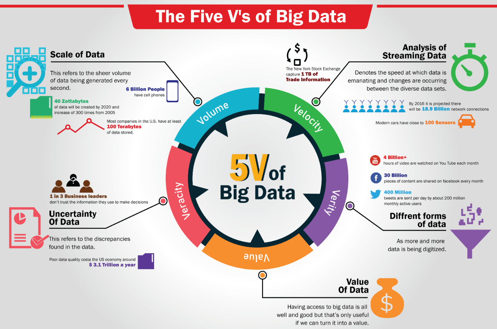
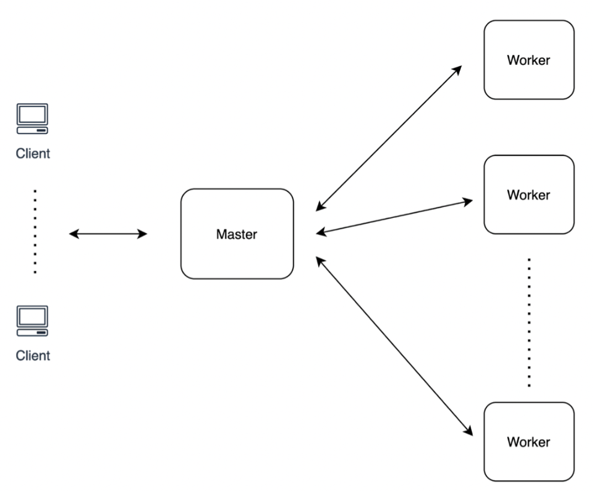
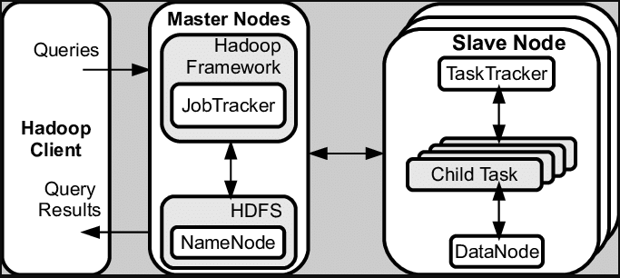
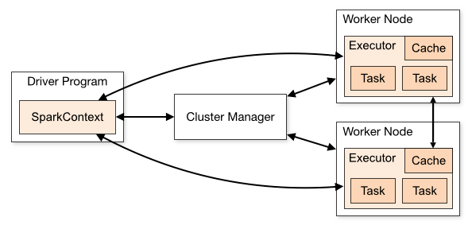

# Apache Spark for Java Developers

> Apache Spark is a multi-language engine for executing data engineering, data science, and machine learning on single-node machines or clusters.

Key Features:

- SQL analytics using **RDDs** and **SparkSQL**

Execute fast, distributed ANSI SQL queries for dash-boarding and ad-hoc reporting. Runs faster than most data
warehouses.

- Machine learning using **SparkML**

Train machine learning algorithms on a laptop and use the same code to scale to fault-tolerant clusters of thousands of
machines.

- Batch/streaming data using **Spark Streaming**

Unify the processing of data in batches and real-time streaming.

## Table of contents

### Part I - Spark RDD

1. The Big Picture
2. Spark Installation and IntelliJ Project Setup
3. Spark RDD - First Program
4. Create RDD using parallelize()
5. Create RDD using External Datasets
6. Spark RDD - Reduces
7. Spark RDD - Mapping
8. Spark RDD - Printing elements
10. Spark RDD - Tuples
11. Spark RDD - PairRDDs
12. Spark RDD - FlatMaps
13. Spark RDD - Filters
14. Exercise 1 - Unique Word Count
15. Spark RDD - Closures and Shared Variables
16. Spark RDD - Joins
17. Spark RDD - Persistence
18. Spark RDD - Shuffles
19. Exercises and Solutions
20. Spark RDD - Submitting applications
21. Databricks and AWS EMR
22. Introduction to Kryo Serialization
23. Tuning Spark

### Part II - Spark SQL

### Part III - Spark ML

### Part IV - Spark Streaming

### Youtube

[Java and Spark playlist](https://www.youtube.com/playlist?list=PLQDzPczdXrTgqEc0uomGYDS0SFu7qY3g3)

---

### Chapter 01. The Big Picture

#### Big Data

Big data is a term that describes large, hard-to-manage volumes of data – both _structured_ and _unstructured_ – that
inundate businesses on a day-to-day basis.

These data sets are so voluminous that traditional data processing software just can’t manage them. But these massive
volumes of data can be used to address business problems we would not have been able to tackle before.



| Name | Value (10^) | Value (2^) |
| ----------- |-------------|------------|
| kilobyte (kB) | 10^3        | 2^10       |
| megabyte (MB)    | 10^6        | 2^20       |
| gigabyte (GB)    | 10^9        | 2^30       |
| terabyte (TB)    | 10^12       | 2^40       |
| petabyte (PB)    | 10^15       | 2^50       |
| exabyte (EB)    | 10^18       | 2^60       |
| zettabyte (ZB) | 10^21       | 2^70       |
| yottabyte (YB) | 10^24       | 2^80       |

The **5V's** of Big Data:

###### Volume

The amount of data matters. With big data, we’ll have to process high volumes of low-density, unstructured data. This
can be data of unknown value, such as Twitter data feeds, click-streams on a web page or a mobile app, or sensor-enabled
equipment. For some organizations, this might be tens of terabytes of data. For others, it may be hundreds of petabytes.

###### Velocity

Velocity is the fast rate at which data is received and (perhaps) acted on. Normally, the highest velocity of data
streams directly into memory versus being written to disk. Some internet-enabled smart products operate in real time or
near real time and will require real-time evaluation and action.

###### Variety

Variety refers to the many types of data that are available. Traditional data types were structured and fit neatly in a
relational database. With the rise of big data, data comes in new unstructured data types. Unstructured and
semi-structured data types, such as text, audio, and video, require additional preprocessing to derive meaning and
support metadata.

###### Value

The bulk of data having no Value is of no good to the company, unless we turn it into something useful. Data in itself
is of no use or importance, but it needs to be converted into something valuable to extract information. Hence, we can
state that Value is the most important V of all the 5V’s.

###### Veracity

Veracity refers to inconsistencies and uncertainty in data, that is data which is available can sometimes get messy and
quality and accuracy are difficult to control. Big Data is also variable because of the multitude of data dimensions
resulting from multiple disparate data types and sources. Example: Data in bulk could create confusion whereas less
amount of data could convey half or incomplete information.

#### Local versus Distributed Systems

Big data can not be processed or stored in a local system or a single node. It requires multiple machines or nodes to
store / process it.

**Master Node => Worker nodes**

A local single node will use the computation sources (CPU, cores) and storage (memory, hard disk) of a single machine
only. Only **vertical scaling** is possible which means we can add powerful CPU or memory to a single machine but there
will be a limit to it. Single point of failure if the local node goes down which makes it essential to store the
important data in cloud or separate disk.

A distributed system has access to the computation sources (CPU, cores) and storage (memory, hard disk) across a number
of machines connected through a network. **Horizontal scaling** is easier by just adding new nodes or systems to the
distributed system. It also supports **fault tolerance**, if one machine fails, the whole network can still go on.



#### Apache Hadoop and MapReduce

Apache Hadoop is a collection of open-source software utilities that facilitates using a network of many computers to
solve problems involving massive amounts of data and computation. It provides a software framework for distributed
storage and processing of big data using the **MapReduce** programming model.

Hadoop uses **Hadoop Distributed File System (HDFS)** which is a distributed, scalable, and portable file system written
in Java for the Hadoop framework and allows user to work with large data sets. It also duplicates blocks of data for
**fault tolerance**.

HDFS uses **MapReduce** which allows computations on that data.

HDFS uses blocks of data of default size **128 MB** and replicates it multiple times to the slave nodes for fault
tolerance.

**MapReduce** is a way of splitting a computational task to a distributed set of files such as HDFS. It consists of a
**Job Tracker** at **Master** Node and multiple **Task Trackers** in the **slave** nodes. Job Tracker sends code to run
on the Task Trackers. The Task Trackers allocate CPU and memory for the tasks and monitor the tasks on the worker nodes.



To summarize,

- **HDFS** is used to distribute large data sets
- **MapReduce** is used to distribute a computational task to a distributed data set

#### Apache Spark

Apache Spark is a multi-language engine for executing data engineering, data science, and machine learning on
single-node machines or clusters.

Key Features:

- SQL analytics using **RDDs** and **SparkSQL**

Execute fast, distributed ANSI SQL queries for dashboards and ad-hoc reporting. Runs faster than most data warehouses.

- Machine learning using **SparkML**

Train machine learning algorithms on a laptop and use the same code to scale to fault-tolerant clusters of thousands of
machines.

- Batch/streaming data using **Spark Streaming**

Unify the processing of data in batches and real-time streaming.

Spark is a flexible alternative to MapReduce.

MapReduce requires files to be stored only in HDFS, while Spark can work on data stored in a variety of formats like
HDFS, AWS S3, Cassandra, HBase etc.

Spark can perform operations up to 100X faster than **MapReduce** because MapReduce writes most of the data to disk
after each map and reduce operation; however Spark keeps most of the data in memory after each transformation. Spark
will write to disk only when the memory is full.

#### Cluster Mode Overview



Spark applications run as independent sets of processes on a cluster, coordinated by the `SparkContext` object in our
`main` program (called the `driver` program).

Specifically, to run on a cluster, the `SparkContext` can connect to several types of cluster managers (either Spark’s
own `standalone` cluster manager, `Mesos`, `YARN` or `Kubernetes`), which allocate resources across applications. Once
connected, Spark acquires executors on nodes in the cluster, which are processes that run computations and store data
for our application. Next, it sends our application code (defined by JAR or Python files passed to `SparkContext`) to
the executors. Finally, `SparkContext` sends tasks to the executors to run.

To summarize,

- Each application gets its own executor processes, which stay up for the duration of the whole application and run
  tasks in multiple threads. This has the benefit of isolating applications from each other, on both the scheduling
  side (each driver schedules its own tasks) and executor side (tasks from different applications run in **different**
  JVMs). However, it also means that data cannot be shared across different Spark applications (instances
  of `SparkContext`) without writing it to an external storage system.
- Spark is agnostic to the underlying cluster manager. As long as it can acquire executor processes, and these
  communicate with each other, it is relatively easy to run it even on a cluster manager that also supports other
  applications (e.g. Mesos/YARN/Kubernetes).
- The driver program must listen for and accept incoming connections from its executors throughout its lifetime. As
  such, the driver program must be network addressable from the worker nodes.
- Because the driver schedules tasks on the cluster, it should be run close to the worker nodes, preferably on the same
  local area network. If we’d like to send requests to the cluster remotely, it’s better to open an RPC to the driver
  and have it submit operations from nearby than to run a driver far away from the worker nodes.

#### Spark RDDs

**RDD (Resilient Distributed Dataset)** is the fundamental data structure of Apache Spark which are an immutable
collection of objects which computes on the different nodes of the cluster. Each and every dataset in Spark RDD is
logically partitioned across many servers so that they can be computed on different nodes of the cluster.

RDD has these main features:

- Distributed collection of data
- Immutable, lazily evaluated and cacheable
- Fault-tolerant “in-memory” computations
- Parallel operation - partitioned
- Ability to use many data sources

RDDs support 2 kinds of operations:

1. **Transformation** – Spark RDD transformation is a function that produces new RDD from the existing RDDs. The
   transformer takes RDD as input and produces one or more RDD as output. Transformations are **lazy** in nature i.e.,
   they get execute when we call an action.

2. **Action** – transformations create RDDs from each other, but when we want to work with the actual data set, at that
   point action is performed. Thus, Actions are Spark RDD operations that give non-RDD values. The values of action are
   stored to drivers or to the external storage system.

An action is one of the ways of sending data from **Executor** to the driver.

**Executors** are agents that are responsible for executing a task. While the driver is a JVM process that coordinates
workers and execution of the task. Some actions of Spark are count and collect.

---

### Chapter 02. Spark Installation and IntelliJ Project Setup

#### Download Apache Spark and Hadoop

1. Download Apache Spark version 3.3.1 from [spark official site](https://spark.apache.org/downloads.html)
2. Download Spark zipped file
   [spark-3.3.1-bin-hadoop3.tgz](https://www.apache.org/dyn/closer.lua/spark/spark-3.3.1/spark-3.3.1-bin-hadoop3.tgz)
3. Unzip the file to local folder - `tar -zxvf spark-3.3.1-bin-hadoop3.tgz`
4. Set `SPARK_HOME` environment variable to `<downloaded folder>\spark-3.3.1-bin-hadoop3`
5. Set `HADOOP_HOME` environment variable to `<downloaded folder>\spark-3.3.1-bin-hadoop3`
6. Add to the `PATH` environment, the `%SPARK_HOME%\bin`
7. Add to the `PATH` environment, the `%HADOOP_HOME%\bin`

#### Download winutils.exe (only for Windows)

Download [winutils.exe](https://github.com/steveloughran/winutils/blob/master/hadoop-3.0.0/bin/winutils.exe) and place
it in local `%SPARK_HOME%\bin` folder.

#### Verify Spark installation

1. Open Windows command prompt `cmd` as **Administrator**
2. Navigate to folder `%SPARK_HOME%\bin` by typing command: `cd %SPARK_HOME%\bin`
3. Launch spark shell: `spark-shell2.cmd`
4. Output will display lots of information like log level, Spark/Scala/Java version, Spark Context Web UI, Spark
   context, Spark session objects, etc.
5. Type few commands to learn some basics

- Spark Session (can be multiple per JVM)

```
scala> spark
res1: org.apache.spark.sql.SparkSession = org.apache.spark.sql.SparkSession@d6db63e
```

- Spark Context (1 per JVM)

```
scala> sc
res2: org.apache.spark.SparkContext = org.apache.spark.SparkContext@4da86d09
```

- Create Spark RDD

```
scala> val myRdd = spark.sparkContext.parallelize(Seq(5,4,3,2,1))
myRdd: org.apache.spark.rdd.RDD[Int] = ParallelCollectionRDD[0] at parallelize at <console>:22
```

- Print the above RDD

```
scala> myRdd.foreach(println)
4
3
2
1
5
```

- Count number of partitions in RDD

```
scala> myRdd.getNumPartitions
res5: Int = 4
```

- Count RDD elements

```
scala> myRdd.count
res6: Long = 5
```

- Exit Spark Shell

```
scala> :quit
```

#### IntelliJ Project Setup - Maven

We can create a Maven project and add spark dependencies.

```
<dependency>
    <groupId>org.apache.spark</groupId>
    <artifactId>spark-core_2.13</artifactId>
    <version>${apache-spark.version}</version>
</dependency>

<dependency>
    <groupId>org.apache.spark</groupId>
    <artifactId>spark-sql_2.13</artifactId>
    <version>${apache-spark.version}</version>
</dependency>

<dependency>
    <groupId>org.apache.hadoop</groupId>
    <artifactId>hadoop-hdfs</artifactId>
    <version>3.3.4</version>
</dependency>
```

Latest apache spark version as of this writing is **3.3.1**

Complete `pom.xml` can be found at Github:
[pom.xml](https://github.com/backstreetbrogrammer/11_JavaSpark/pom.xml)

Run Maven Verify command to ensure Maven setup is complete: `mvn verify`


---

### Chapter 03. Spark RDD - First Program

Every Spark application consists of a **driver program** that runs the user’s `main` function and executes various
parallel operations on a cluster. Spark provides RDD, which is a collection of elements partitioned across the nodes of
the cluster that can be operated on in parallel.

RDDs are created by starting with a file in HDFS or other supported file systems, or an existing Scala collection in the
driver program, and transforming it. Users may also ask Spark to persist an RDD in **memory**, allowing it to be reused
efficiently across parallel operations. Also, RDDs automatically recover from node failures.

Spark uses **shared variables** in parallel operations. By default, when Spark runs a function in parallel as a set of
tasks on different nodes, it ships a copy of each variable used in the function to each task. Sometimes, a variable
needs to be shared across tasks, or between tasks and the driver program.

Spark supports 2 types of shared variables:

- **broadcast variables** => to cache a value in memory on all nodes
- **accumulators** => variables that are only “added” to, such as counters and sums

#### Initializing Spark

1. Build a `SparkConf` object that contains information about the application

```
final var conf = new SparkConf().setAppName("SparkFirstProgram").setMaster("local[*]");
```

The `appName` parameter is a name for the application to show on the cluster UI.

The `master` is a
[Spark, Mesos or YARN cluster URL](https://spark.apache.org/docs/latest/submitting-applications.html#master-urls), or a
special “local” string to run in local mode. When running on a cluster, we will not want to hardcode master in the
program, but rather launch the application
with [spark-submit](https://spark.apache.org/docs/latest/submitting-applications.html) and receive it there. However,
for local testing and unit tests, we can pass “local” to run Spark in-process.

`local[*]` means run Spark locally with as many worker threads as logical cores on the machine.

2. Create a `JavaSparkContext` object which tells Spark how to access a cluster, by passing the `SparkConf` object to
   its constructor

```
final var sc = new JavaSparkContext(conf);
```

3. Create RDD which is a fault-tolerant collection of elements that can be operated on in parallel

There are two ways to create RDDs:

- **parallelizing** an existing collection in the driver program (only used for POC or prototyping)
- referencing a dataset in an **external storage system**, such as a shared filesystem, HDFS, HBase, or any data source
  offering a Hadoop `InputFormat`

4. Spark UI can be viewed in browser using default port of 4040:

```
http://localhost:4040/
```

---

### Chapter 04. Create RDD using parallelize()

Parallelized collections are created by calling JavaSparkContext’s `parallelize() `method on an existing
`Collection` in the **driver** program. The elements of the collection are copied to form a **RDD** that can be operated
on in parallel.

```
final var data = List.of(1, 2, 3, 4, 5, 6, 7, 8);
final var myRdd = sc.parallelize(data);
```

RDD created `myRdd` can be operated on in parallel. These operations can be to _reduce_, _map_, etc.

```
final var max = myRdd.reduce(Integer::max);
final var min = myRdd.reduce(Integer::min);
final var sum = myRdd.reduce(Integer::sum);
```

One important parameter for parallel collections is the number of **partitions** to cut the dataset into. Spark will run
one task for each partition of the cluster.

We may want 2-4 partitions for each CPU in the cluster. Spark tries to set the number of partitions automatically based
on our cluster.

We can get the number of partitions being used by calling this method:

```
myRdd.getNumPartitions()
```

However, we can also set it manually by passing it as a second parameter to parallelize() method.

```
sc.parallelize(data, 10)
```

---

### Chapter 06. Spark RDD - Reduces

As discussed, once `JavaRDD` object is created, it can be used to perform `reduce` operation.

In functional programming-language jargon, this is referred to as a **fold** because we can view this operation as
repeatedly folding a long piece of paper (our stream) until it forms a small square, which is the result of the **fold**
operation.

Example:

```
final var max = myRdd.reduce(Integer::max);
final var min = myRdd.reduce(Integer::min);
final var sum = myRdd.reduce(Integer::sum);
```

---

### Chapter 05. Spark RDD - Mapping

Transformation: `map(func)`

> Return a new distributed dataset formed by passing each element of the source through a function `func`.

As RDDs are immutable, after applying the `map` transformation, new RDD is created.

The `func` is applied to each element, mapping it into a new element (the word mapping is used because it has a meaning
similar to transforming but with the nuance of “creating a new version of” rather than “modifying”).

Example:

```
final var myList = myRdd.map(String::length).collect();
final var count = myRdd.map(String::length).count();
final var count = myRdd.map(String::length).map(v -> 1L).reduce(Long::sum);
```

---

### Chapter 06. Spark RDD - Printing elements

We can print out the elements of an RDD using:

```
rdd.foreach(println)
OR 
rdd.map(println) 
```

On a **single** machine, this will generate the expected output and print all the RDD’s elements.

However, in **cluster** mode, the output to stdout being called by the executors is now writing to the **executor’s**
stdout instead, not the one on the **driver**, so stdout on the driver won’t show these.

Also, we may see `NotSerializableException` in few cases when the data is huge.

To print all elements on the **driver**, one can use the `collect()` method to first bring the RDD to the driver node:

```
rdd.collect().foreach(println)
```

This can cause the driver to run **out of memory**, though, because `collect()` fetches the entire RDD to a **single**
machine; if we only need to print a few elements of the RDD, a safer approach is to use the `take()` method:

```
rdd.take(100).foreach(println)
```

---

### Chapter 07. Spark RDD - External Datasets

Spark can create distributed datasets from any storage source supported by Hadoop like:

- Local file system
- HDFS
- Cassandra
- HBase
- Amazon S3, etc.

Spark supports:

- Text files
- [SequenceFiles](https://hadoop.apache.org/docs/stable/api/org/apache/hadoop/mapred/SequenceFileInputFormat.html)
- Any Hadoop [InputFormat](https://hadoop.apache.org/docs/stable/api/org/apache/hadoop/mapred/InputFormat.html)

**Text file** RDDs can be created using `SparkContext`’s `textFile()` method. This method takes a **URI** for the file
(either a local path on the machine, or a `hdfs://`, `s3a://`, etc. URI) and reads it as a collection of lines.

Example:

```
JavaRDD<String> dataFile = sc.textFile("data.txt");
```

Once created, `dataFile` can be acted on by dataset operations like _map_ or _reduce_.

Few important points to read files in Spark:

- If using a path on the local filesystem, the file must also be accessible at the same path on **worker nodes**. Either
  copy the file to all workers or use a network-mounted shared file system.
- All of Spark’s file-based input methods, including `textFile`, support running on **directories**, **compressed**
  files, and **wildcards** as well. For example, we can use:

```
sc.textFile("/my/directory")
sc.textFile("/my/directory/*.txt")
sc.textFile("/my/directory/*.gz")
```

- The `textFile()` method also takes an optional **second** argument for controlling the number of partitions of the
  file. By default, Spark creates **one** partition for each block of the file (blocks being `128MB` by default in HDFS)
  , but we can also ask for a higher number of partitions by passing a larger value. Note that we cannot have fewer
  partitions than blocks.

Apart from **text files**, Spark’s Java API also supports several other data formats:

- `JavaSparkContext.wholeTextFiles()` lets us read a directory containing multiple small text files, and returns each of
  them as **(filename, content)** pairs. This is in contrast with `textFile()`, which would return one record per line
  in each file.
- For [SequenceFiles](https://hadoop.apache.org/docs/stable/api/org/apache/hadoop/mapred/SequenceFileInputFormat.html),
  use SparkContext’s `sequenceFile[K, V]` method where `K` and `V` are the types of key and values in the file. These
  should be subclasses of
  Hadoop’s [Writable](https://hadoop.apache.org/docs/stable/api/org/apache/hadoop/io/Writable.html) interface, like
  [IntWritable](https://hadoop.apache.org/docs/stable/api/org/apache/hadoop/io/IntWritable.html)
  and [Text](https://hadoop.apache.org/docs/stable/api/org/apache/hadoop/io/Text.html).
- For other Hadoop `InputFormats`, we can use the `JavaSparkContext.hadoopRDD()` method, which takes an arbitrary
  `JobConf` and input format class, key class and value class. Set these the same way we would for a Hadoop job with our
  input source. We can also use `JavaSparkContext.newAPIHadoopRDD()` for `InputFormats` based on the “new” MapReduce
  API (`org.apache.hadoop.mapreduce`).
- `JavaRDD.saveAsObjectFile()` and `JavaSparkContext.objectFile()` support saving an RDD in a simple format consisting
  of **serialized** Java objects. While this is not as efficient as specialized formats like **Avro**, it offers an easy
  way to save any RDD.

---

### Chapter 08. Spark RDD - Tuples

In Scala, a **tuple** is a value that contains a fixed number of elements, each with its own type. Tuples are immutable.
Tuples are especially handy for returning multiple values from a method.

A tuple with two elements can be created as follows:

```
val person = ("John", 25)
```

This creates a tuple containing a `String` element and an `Int` element. The inferred type of `person`
is `(String, Int)`.

Tuples are of type `Tuple1`, `Tuple2`, `Tuple3` and so on. There currently is an upper limit of **22** in the Scala if
we need more. For each `TupleN` type, where `1 <= N <= 22`, Scala defines a number of element-access methods.

Example:

```
final var tuple2JavaRDD = myRdd.map(line -> new Tuple2<>(line, line.length()));
```

---

### Chapter 09. Spark RDD - PairRDDs

While most Spark operations work on RDDs containing any type of objects, a few special operations are only available on
RDDs of **key-value pairs**. The most common ones are distributed “shuffle” operations, such as grouping or aggregating
the elements by a key.

In Java, key-value pairs are represented using the `scala.Tuple2` class from the Scala standard library. We can simply
call `new Tuple2(a, b)` to create a tuple, and access its fields later with `tuple._1()` and `tuple._2()`.

RDDs of key-value pairs are represented by the `JavaPairRDD` class. We can construct `JavaPairRDDs` from `JavaRDDs`
using special versions of the map operations, like `mapToPair` and `flatMapToPair`. The `JavaPairRDD` will have both
standard RDD functions and special key-value ones.

For example, the following code uses the `reduceByKey` operation on key-value pairs to count how many times each line of
text occurs in a file:

```
final var lines = sc.textFile("data.txt");
final var pairs = lines.mapToPair(s -> new Tuple2<>(s, 1L));
final var counts = pairs.reduceByKey(Long::sum);
```

We could also use `counts.sortByKey()`, for example, to sort the pairs alphabetically, and finally `counts.collect()` to
bring them back to the driver program as an array of objects.

When using custom objects as the key in key-value pair operations, we must be sure that a custom `equals()` method is
accompanied by a matching `hashCode()` method.

---

### Chapter 10. Spark RDD - FlatMaps

Transformation: `flatMap(func)`

> Similar to map, but each input item can be mapped to 0 or more output items
> (so `func` should return a `Seq` or `Iterable` rather than a single item).

As RDDs are immutable, after applying the `flatMap` transformation, new RDD is created.

However, in functional programming-language jargon, the `flatMap` method lets us replace each value of a stream with
another stream and then concatenates all the generated streams into a single stream.

---

### Chapter 11. Spark RDD - Filters

Transformation: `filter(func)`

> Return a new dataset formed by selecting those elements of the source on which `func` returns true.

As RDDs are immutable, after applying the `filter` transformation, new RDD is created.

---

### Chapter 12. Exercise 1 - Unique Word Count

#### Task: Count unique English words from the given file - numbers, punctuations, space, tabs, etc. should NOT be counted.

Also, the words should be case-insensitive, i.e. "Java" and "java" should be counted same.

Example output _(word, count)_ :

```
(someone,5)
(therefor,2)
(greater,5)
(ratification,2)
(full,14)
(secure,4)
(bailiffs,14)
(old,7)
(order,7)
(carried,2)
```

Meaning that word "someone" appeared total 5 times in the given file.

#### Bonus Task: Find the top 10 words with maximum counts

---

### Chapter 13. Spark RDD - Closures and Shared Variables

A `closure` is an instance of a **function** that can reference non-local variables of that **function** with no
restrictions.

For example, a closure could be passed as argument to another function. It could also access and modify variables
defined outside its scope.

#### Understanding closure concept in Java

Java lambdas and anonymous classes do something similar to closures: they can be passed as argument to methods and can
access variables outside their scope.

But they have a restriction: they can’t modify the content of local variables of a method in which the lambda is
defined. Those variables have to be `final` or **effectively final**. It helps to think that lambdas close over values
rather than variables.

This restriction exists because local variables live on the `stack` and are implicitly confined to the thread they’re
in. Allowing capture of **mutable** local variables opens new thread unsafe possibilities, which are undesirable
(instance variables are fine because they live on the `heap`, which is shared across threads).

Example:

Following code will NOT compile as `String` **name** variable is not `final` or **effectively final**:

```
String name = "John";
Runnable r = () -> System.out.println(name); // WILL NOT COMPILE
name = "Betty";
```

#### Understanding closure concept in Spark

We need to understand the scope and life cycle of variables and methods when executing code across a cluster. RDD
operations that modify variables outside their scope can be a frequent source of confusion.

Example:

Following code will NOT compile as `int` **sum** variable is not `final` or **effectively final**:

```
final var data = List.of(1, 2, 3, 4, 5, 6, 7, 8, 9, 10);
final var myRdd = sparkContext.parallelize(data);
int sum = 0;
myRdd.foreach(x -> sum += x); // WILL NOT COMPILE
System.out.printf("Total sum: %d%n", sum);
```

To execute jobs, Spark breaks up the processing of RDD operations into **tasks**, each of which is executed by an
**executor**. Prior to execution, Spark computes the task’s `closure`. The `closure` are those variables and methods
which must be visible for the executor to perform its computations on the RDD (in this case `foreach()`). This closure
is **serialized** and sent to each executor.

The variables within the closure sent to each executor are now copies and thus, when `sum` is referenced within the
`foreach()` function, it’s no longer the `sum` on the driver node. There is still a `sum` in the memory of the driver
node but this is no longer visible to the executors! The executors only see the **copy** from the serialized closure.
Thus, the final value of `sum` will still be **zero** since all operations on `sum` were referencing the value within
the serialized closure.

In **local** mode, in some circumstances, the `foreach()` function will actually execute within the same JVM as the
driver and executors will reference the same original `sum`, and may actually update it.

To ensure well-defined behavior in these sorts of scenarios one should use an `Accumulator`.

**Accumulators** in Spark are used specifically to provide a mechanism for safely updating a variable when execution is
split up across worker nodes in a cluster.

In general, closures - constructs like loops or locally defined methods, should not be used to mutate some global state.
Spark does not define or guarantee the behavior of mutations to objects referenced from outside of closures. Some code
that does this may work in local mode, but that’s just by accident and such code will not behave as expected in
distributed mode. Use an **Accumulator** instead if some global aggregation is needed.

#### Accumulators

Accumulators are variables that are only “added” to through an associative and commutative operation and can therefore
be efficiently supported in parallel. They can be used to implement counters (as in MapReduce) or sums. Spark natively
supports accumulators of **numeric** types, and programmers can add support for new types.

A **numeric** accumulator can be created by calling `SparkContext.longAccumulator()`
or `SparkContext.doubleAccumulator()` to accumulate values of type `Long` or `Double`, respectively. Tasks running on a
cluster can then add to it using the `add()` method. However, they **cannot** read its **value**. Only the driver
program can read the accumulator’s value, using its `value()` method.

For accumulator updates performed inside `actions` only, Spark guarantees that each task’s update to the accumulator
will only be applied once, i.e. restarted tasks will not update the value.

In `transformations`, users should be aware of that each task’s update may be applied more than once if tasks or job
stages are re-executed.

Accumulators do not change the `lazy` evaluation model of Spark. If they are being updated within an operation on an
RDD, their value is only updated once that RDD is computed as part of an action. Consequently, accumulator updates are
not guaranteed to be executed when made within a lazy transformation like `map()`.

We can also create our own accumulators by subclassing `AccumulatorV2`. The `AccumulatorV2` abstract class has several
methods which one has to override: `reset()` for resetting the accumulator to zero, `add()` for adding another value
into the accumulator, `merge()` for merging another same-type accumulator into this one, etc. Other methods that must be
overridden are contained in
the [API documentation](https://spark.apache.org/docs/latest/api/scala/org/apache/spark/util/AccumulatorV2.html).

---

### Chapter 14. Spark RDD - Joins

Transformation: `join(otherDataset, [numPartitions])`

When called on datasets of type `(K, V)` and `(K, W)`, returns a dataset of `(K, (V, W))` pairs with all pairs of
elements for each key.

**Outer joins** are supported through `leftOuterJoin()`, `rightOuterJoin()`, and `fullOuterJoin()`.

#### Inner join

> Joins two RDDs based on a common field K, and selects records that have matching values in these fields

#### Left Outer join

> Joins two RDDs based on a common field K, and selects records that have matching values in these fields and remaining
> rows from the **left** RDD.

#### Right Outer join

> Joins two RDDs based on a common field K, and selects records that have matching values in these fields and remaining
> rows from the **right** RDD.

#### Full Outer join

> Joins two RDDs based on a common field K, and selects records that have matching values in these fields and remaining
> rows from **both** of the RDDs.

#### Cartesian

Transformation: `cartesian(otherDataset)`

> When called on datasets of types T and U, returns a dataset of (T, U) pairs (all pairs of elements).

---

### Chapter 15. Spark RDD - Persistence

In Spark, we can **persist** or **cache** a dataset in **memory** across operations.

When we persist an RDD, each node stores any _partitions_ of it that it computes in memory and reuses them in other
actions on that dataset (or datasets derived from it). This allows future actions to be much faster (often by more than
10x). Caching is a key tool for iterative algorithms and fast interactive use.

We can mark an RDD to be persisted using `persist()` or `cache()` methods on it.

The first time it is computed in an **action**, it will be kept in memory on the nodes.

Spark’s cache is **fault-tolerant** – if any partition of an RDD is lost, it will automatically be recomputed using the
transformations that originally created it.

In addition, each persisted RDD can be stored using a different _storage level_, allowing us, for example, to persist
the dataset on **disk**, persist it in **memory** but as serialized Java objects (to save space), replicate it across
nodes. These levels are set by passing a `StorageLevel` object to `persist()`.

The `cache()` method is a shorthand for using the **default** storage level, which is `StorageLevel.MEMORY_ONLY` (store
deserialized objects in memory).

Spark also **automatically** persists some intermediate data in shuffle operations (e.g. `reduceByKey()`), even without
users calling `persist()`. This is done to avoid recomputing the entire input if a node fails during the **shuffle**.

It is recommended to call `persist()` on the resulting RDD if we plan to **reuse** it.

#### Storage Level to chose

Spark’s storage levels are meant to provide different trade-offs between memory usage and CPU efficiency.

Here is the recommended approach:

- If our RDDs fit comfortably with the default storage level (`MEMORY_ONLY`), leave them that way. This is the most
  CPU-efficient option, allowing operations on the RDDs to run as fast as possible.

- If not, try using `MEMORY_ONLY_SER` and selecting a fast serialization library to make the objects much more
  space-efficient, but still reasonably fast to access.

- Don’t spill to disk unless the functions that computed our datasets are expensive, or they filter a large amount of
  the data. Otherwise, recomputing a partition may be as fast as reading it from disk.

- Use the replicated storage levels if we want fast fault recovery (e.g. if using Spark to serve requests from a web
  application). All the storage levels provide full fault tolerance by recomputing lost data, but the replicated ones
  let us continue running tasks on the RDD without waiting to recompute a lost partition.

#### Removing Data

Spark automatically monitors cache usage on each node and drops out old data partitions in a **least-recently-used (
LRU)** fashion. If we would like to manually remove an RDD instead of waiting for it to fall out of the cache, use the
`RDD.unpersist()` method. Note that this method does not block by default. To block until resources are freed, specify
`blocking=true` when calling this method.

---

### Chapter 19. Databricks and AWS EMR

In production, there are always 2 choices to work with Big Data, Clusters and Apache Spark:

- Databricks
- AWS EMR (Elastic MapReduce) and AWS S3

#### Databricks

1. Create an account in Databricks, for the first time - we can create a 14-days trial
   [free account](https://www.databricks.com/try-databricks#account)
2. Databricks does NOT support the Java notebook execution directly. We can only run the notebook in Python, R, Scala
   and SQL. However, we can create an executable jar of java code in our local computer and then upload the jar in the
   Databricks cluster.
3. In the Databricks cluster created - we can go to the **libraries** and upload the jar file as a library there
4. Once uploaded, we need to open a **SCALA** notebook and import the java classes from the library and execute the
   SCALA notebook.

#### AWS EMR

1. Create an account in AWS, for the first time - we can create a 1-year trial
   [free account](https://aws.amazon.com/free)

_work in progress_